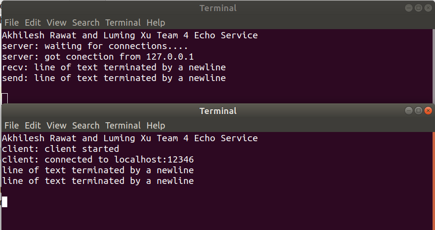
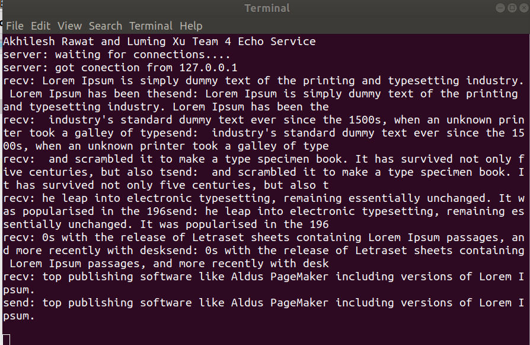
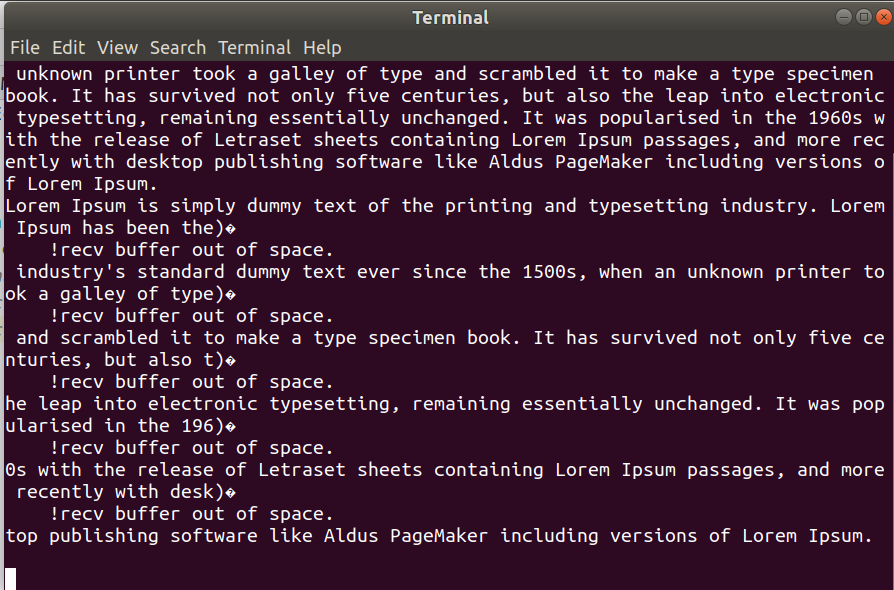
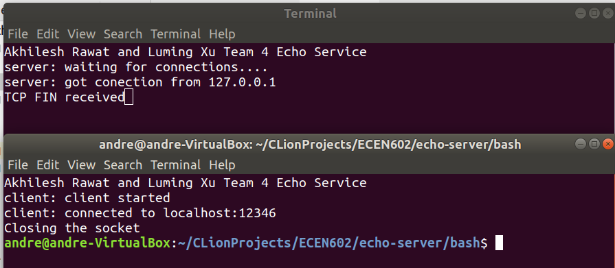
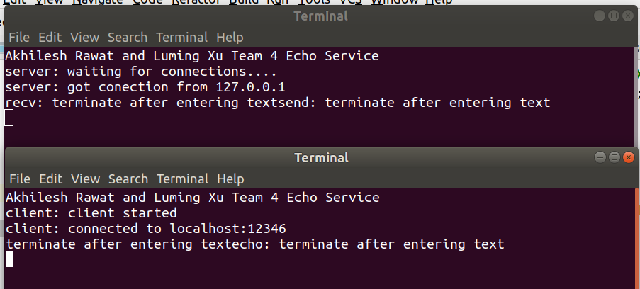
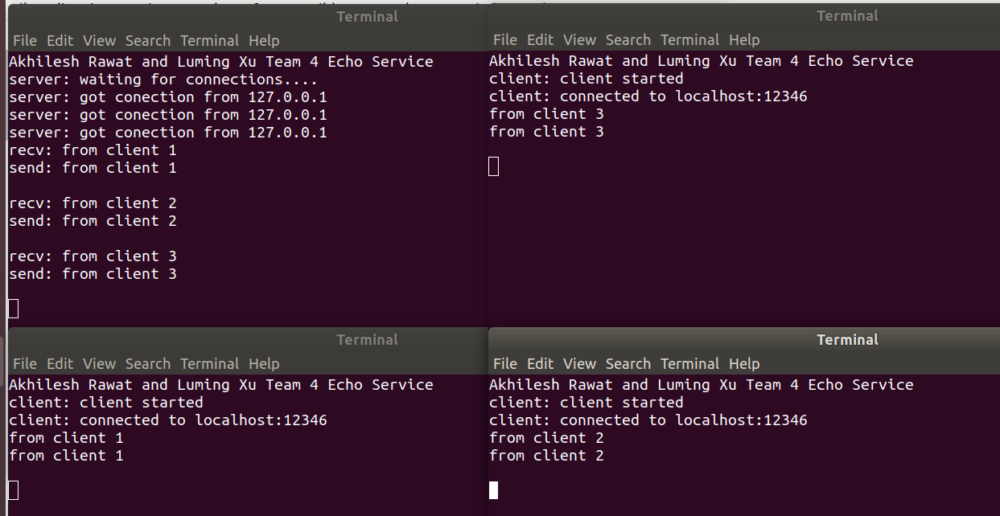

# Team_4 

## TCP Echo Server and Client

## Team members

- Luming:   `client.c`, `test.sh`
- Akhilesh: `server.c`, `Makefile`

## Usage

`SERVER`: `./echos PORT`

`CLIENT`: `./echo IPAddr PORT` 

 ## Architecture

 The server runs on `localhost` and can connect to `BACKLOG` number of clients at a time. It echoes the messages sent to it by the clients respectively. The server serves every new connection request that comes to it on `PORT` number mentioned when started, in a new process.

 The server responds with `TCP FIN received` when a client a diconnects itself from the server.

 The function `sigchild_handler` has been taken verbatim from [Beej's guide](https://beej.us/guide/bgnet/html/single/bgnet.html). For other system calls, which are not automatially restarted when interrupted by a signal handler, we are manually restarting the call [(Reference)](http://man7.org/linux/man-pages/man7/signal.7.html).

## Test Cases
### Case 1: line of text terminated by a newline

### Case 2: line of text exceeding the maximum line length
Input exceeding maximum buffer length are segmented into several packets.
#### Server Side Capture

#### Client Side Capture

### Case 3: line with no characters and EOF

### Case 4: client terminated after entering text

### Case 5: three clients conected to the server

