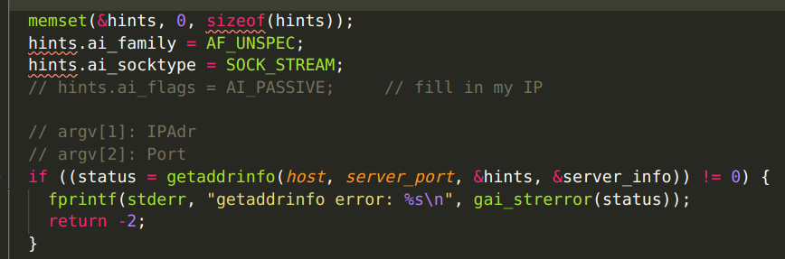

# TCP Simple Broadcast Chat Server and Client

## Code Style

* Using snake_case 
* indent with tabsize: 4

## Role of Team Members

* Luming Xu
    - client code
    - message parser and constructor
    - test cases

* Akhilesh Rawat
    - server code
    - broadcasting
    - Makefile

## Program Execution:

1. run ./run_server.sh
2. run ./run_client.sh

## Program Architecture:

### Parsing Libraries

* server_lib.c and client_lib.c provides message construction and parsing utilities for server and client respectively.
* config.h file includes message exchange format and configurations.

### Server

* server monitors multiple file descriptor(fd) using select to accept new client, while at the same time read and forward message to other clients.
* server associates each fd with a client's username by maintaining a linked list of struct with fd, username and next struct as its members. When a message is sent to the server, it traverses through all the clients and send each with a FWD message. Server count number of nodes in the linked list to control maximum number of clients in the chat.

### Client

* client is using select to monitor FWD message and STDIN at the same time.
* message is packaged in fixed length struct, supports multiple attributes.

### Bonus Points
* Both server and client support IPv4 and IPv6 connection.
* ACK, NAK, ONLINE, and OFFLINE message types are supported, test cases for each are included.
* IDLE status in client is supported by accumulating time elapse from select call, and will send an IDLE message to server when it goes idle.  Sending message from client again will recover itself from IDLE status, and can fall IDLE again after another 10 seconds of no action.

## Test Cases

### Case 1

#### normal operation of the chat with three clients connected


### Case 2

#### server rejects a client with a duplicate username


### Case 3

#### server allows a previously used username to be reused


### Case 4

#### server rejects the client because it exceeds the maximum number 
#### server rejects the client because it exceeds the maximum number 


### Case 5

#### IPv4 and IPv6 support
The following code in server supports both IPv4 and IPv6.


The following code in client supports both IPv4 and IPv6.



### Case 6

#### bonus feature 1
ACK, NAK, ONLINE, and OFFLINE are all implemented.

receive ACK prints:

    JOIN SUCCESS! Your username: [ USERNAME ]

receive NAK prints:

    JOIN REJECTED! NAK REASON: [ REASON ]

receive ONLINE prints:

    [ USERNAME ] has joined the chat

receive OFFLINE prints:

    [ USERNAME ] has left the chat

### Case 7

### bonus feature 2
When a client goes idle, it sends IDLE message to other clients. Other clients print: 

    
    [ USERNAME ] is now idle.


## Source Code

### config.h

``` c
#ifndef CONFIG_H_
#define CONFIG_H_

#include <stdint.h>

#define VRSN 3
#define MAXDATASIZE 1500
#define MAX_MSG_LEN 512
typedef enum {
  JOIN = 2,     // CLIENT TO SERVER, USERNAME
  FWD = 3,      // SERVER TO CLIENT, MESSAGE + USERNAME
  SEND = 4,     // CLIENT TO SERVER, MESSAGE
  NAK = 5,      // SERVER TO CLIENT, REASON
  OFFLINE = 6,  // SERVER TO CLIENT, USERNAME
  ACK = 7,      // SERVER TO CLIENT, CLIENT_COUNT, USERNAME(S)
  ONLINE = 8,   // SERVER TO CLIENT, USERNAME
  IDLE = 9      // SERVER TO CLIENT, USERNAME; CLIENT TO SERVER, NONE
} sbcp_header_type_t;

typedef enum {
  REASON = 1,
  USERNAME = 2,
  CLIENTCOUNT = 3,
  MESSAGE = 4
} sbcp_attribute_type_t;

typedef struct {
  uint16_t sbcp_attribute_type;
  uint16_t len;  // record written payload size
  char payload[512];
} sbcp_attribute_t;

typedef struct {
  uint32_t vrsn_type_len;  // vrsn: 9 bits; type: 7 bits; len: 16 bits
  sbcp_attribute_t sbcp_attributes[2];  // payload
} sbcp_msg_t;

#endif

```

### Makefile

``` Makefile
C = gcc
# DEPS = headers.h 

TARGETS = server client 

all: $(TARGETS)

server: server.o server_lib.o common_lib.o headers.o
	$(C) -o server server.o server_lib.o common_lib.o

server.o : server.h

headers.o: headers.h

server_lib.o : server_lib.h

client : client.o client_lib.o common_lib.o headers.o
	$(C) -o client client.o client_lib.o common_lib.o

client.o : client.h

client_lib.o : client_lib.h
headers.o: headers.h
common_lib.o : common_lib.h

clean:
	rm -f *.o server client 
```

### run_client.sh

``` shell
rm client
clear
make client
./client Cantrell localhost 12345

```

### run_server.sh

``` shell
rm server
clear
make server
./server localhost 12345 2

```

### server.c

``` c
#include "server.h"

#define MAXDATASIZE 1500

int main(int argc, char *argv[]) {
  int sockfd, new_fd;
  int numbytes;
  int msg_type;
  sbcp_msg_t msg_send, *msg_recv;

  if (argc != 4) {  // check for correct usage
    fprintf(stderr, "usage: ./server server_ip server_port max_clients\n");
    exit(1);
  }
  char *server_ip = argv[1], *server_port = argv[2];
  int max_clients = atoi(argv[3]);

  // create server node
  sockfd = server_init(server_port);
  socket_fd_t *listen_fd = malloc(sizeof(socket_fd_t));
  listen_fd->fd = sockfd;
  strcpy(listen_fd->username, "server");
  listen_fd->next = NULL;

  // add select in server on sock_fd and stdin
  fd_set readfds;

  while (1) {
    fd_select(&readfds, *listen_fd);

    if (!FD_IS_ANY_SET(&readfds)) {  // timer expires
      // printf("expires.\n");
      print_nodes(listen_fd);
      continue;
    }

    msg_router(listen_fd, readfds, max_clients);
    
    // printf("node traversal ends.\n");
  }  // while loop

  return 0;
}

```

### server.h

``` c
#include "server_lib.h"
#include "common_lib.h"

```

### server_lib.c

``` c
#include "server_lib.h"

//-------- SOCKET FD MANAGEMENT --------

void fd_select(fd_set *readfds, socket_fd_t listen_fd) {
  int max_fd;
  struct timeval tv;
  FD_ZERO(readfds);
  FD_SET(listen_fd.fd, readfds);

  tv.tv_sec = 25;
  tv.tv_usec = 500000;
  socket_fd_t *node = &listen_fd;

  // traverse through all fds, get max fd and call select
  while (node != NULL) {
    FD_SET(node->fd, readfds);
    max_fd = (max_fd > node->fd) ? max_fd : node->fd;
    node = node->next;
  }
  select(max_fd + 1, readfds, NULL, NULL, &tv);
}

/* Given a reference (pointer to pointer) to the head
of a list and an int, appends a new node at the end */
void append_node(socket_fd_t **head_ref, int new_fd, char *new_username) {
  /* 1. allocate node */
  socket_fd_t *new_node = (socket_fd_t *)malloc(sizeof(socket_fd_t));
  socket_fd_t *last = *head_ref; /* used in step 5*/

  /* 2. put in the data */
  new_node->fd = new_fd;
  memcpy(new_node->username, new_username, strlen(new_username));

  /* 3. This new node is going to be the last node, so make next of
          it as NULL*/
  new_node->next = NULL;

  /* 4. If the Linked List is empty, then make the new node as head */
  if (*head_ref == NULL) {
    *head_ref = new_node;
    return;
  }

  /* 5. Else traverse till the last node */
  while (last->next != NULL) last = last->next;

  /* 6. Change the next of last node */
  last->next = new_node;
  return;
}

// This function prints contents of linked list starting from head
void print_nodes(socket_fd_t *node) {
  printf("  Monitored Nodes: \n");
  while (node != NULL) {
    printf("    %d: %s\n", node->fd, node->username);
    node = node->next;
  }
}

//-------- END OF SOCKET FD MANAGEMENT --------

// join 2-d username array to 1-d array of size 512
char *str_join(char *buf, char string_array[10][16]) {
  // assume buffer has 512 size
  for (int i = 0; i < 16; i++) {
    memcpy(buf + i * 16, string_array[i], 16);
  }
  return buf;
}

sbcp_msg_t make_msg_fwd(char *message, size_t msg_len, char *username,
                        size_t name_len) {
  sbcp_msg_t msg_fwd = {0};
  msg_fwd.vrsn_type_len = (VRSN << 23 | FWD << 16 | sizeof(sbcp_msg_t));

  // fill in message part
  msg_fwd.sbcp_attributes[0].sbcp_attribute_type = MESSAGE;
  msg_fwd.sbcp_attributes[0].len = msg_len;
  memcpy(msg_fwd.sbcp_attributes[0].payload, message, msg_len);

  // fill in username part
  msg_fwd.sbcp_attributes[1].sbcp_attribute_type = USERNAME;
  msg_fwd.sbcp_attributes[1].len = name_len;
  memcpy(msg_fwd.sbcp_attributes[1].payload, username, name_len);

  return msg_fwd;
}

// bonus feature: REASON attribute
sbcp_msg_t make_msg_nak(char *reason, size_t reason_len) {
  sbcp_msg_t msg_nak = {0};
  msg_nak.vrsn_type_len = (VRSN << 23 | NAK << 16 | sizeof(sbcp_msg_t));

  // fill in reason part
  msg_nak.sbcp_attributes[0].sbcp_attribute_type = REASON;
  msg_nak.sbcp_attributes[0].len = reason_len;
  memcpy(msg_nak.sbcp_attributes[0].payload, reason, reason_len);

  return msg_nak;
}

// bonus feature: OFFLINE attribute
sbcp_msg_t make_msg_offline(char *username, size_t name_len) {
  sbcp_msg_t msg_offline = {0};
  msg_offline.vrsn_type_len = (VRSN << 23 | OFFLINE << 16 | sizeof(sbcp_msg_t));

  // fill in offline username
  msg_offline.sbcp_attributes[0].sbcp_attribute_type = USERNAME;
  msg_offline.sbcp_attributes[0].len = name_len;
  memcpy(msg_offline.sbcp_attributes[0].payload, username, name_len);

  return msg_offline;
}

// count should be inclusive of the requestor
sbcp_msg_t make_msg_ack(int count, char *usernames) {
  sbcp_msg_t msg_ack = {0};
  msg_ack.vrsn_type_len = (VRSN << 23 | ACK << 16 | sizeof(sbcp_msg_t));

  // fill in client count
  char count_str[5];
  sprintf(count_str, "%d", count);
  msg_ack.sbcp_attributes[0].sbcp_attribute_type = CLIENTCOUNT;
  msg_ack.sbcp_attributes[0].len = sizeof(count_str);
  memcpy(msg_ack.sbcp_attributes[0].payload, count_str, sizeof(count_str));

  // fill in client names
  msg_ack.sbcp_attributes[1].sbcp_attribute_type = USERNAME;
  msg_ack.sbcp_attributes[1].len = sizeof(160);
  memcpy(msg_ack.sbcp_attributes[1].payload, usernames, 170);

  return msg_ack;
}

sbcp_msg_t make_msg_online(char *username, size_t name_len) {
  sbcp_msg_t msg_online = {0};
  msg_online.vrsn_type_len = (VRSN << 23 | ONLINE << 16 | sizeof(sbcp_msg_t));

  // fill in online username to forward
  msg_online.sbcp_attributes[0].sbcp_attribute_type = USERNAME;
  msg_online.sbcp_attributes[0].len = name_len;
  memcpy(msg_online.sbcp_attributes[0].payload, username, name_len);

  return msg_online;
}

// idle message with username from server fwd to clients
sbcp_msg_t make_msg_idle_s(char *username, size_t name_len) {
  sbcp_msg_t msg_idle = {0};
  msg_idle.vrsn_type_len = (VRSN << 23 | IDLE << 16 | sizeof(sbcp_msg_t));
  // fill in username
  msg_idle.sbcp_attributes[0].sbcp_attribute_type = USERNAME;
  msg_idle.sbcp_attributes[0].len = name_len;
  memcpy(msg_idle.sbcp_attributes[0].payload, username, name_len);
  return msg_idle;
}

void parse_msg_join(sbcp_msg_t msg_join, char *new_name) {
  if (msg_join.sbcp_attributes[0].sbcp_attribute_type == USERNAME) {
    memcpy(new_name, msg_join.sbcp_attributes[0].payload, 16);
    printf("%s want to join the chat.\n", new_name);
  }
}

// empty message, nothing to parse.
void parse_msg_idle(sbcp_msg_t msg_idle) {}

void parse_msg_send(sbcp_msg_t msg_send, char *client_message) {
  memcpy(client_message, msg_send.sbcp_attributes[0].payload, 512);
  // printf("msg: %s\n", );
}

// flatten usernames in nodes to char array
void get_usernames(char *usernames, socket_fd_t *listen_fd) {
  memset(usernames, 0, sizeof(usernames));
  socket_fd_t *node = listen_fd->next;
  int count = 0;
  while (node != NULL) {
    memcpy(usernames + count * 16, node->username, 16);
    count += 1;
    node = node->next;
  }
}

// remove node from linked list of socket fds
void remove_node(socket_fd_t *listen_fd, socket_fd_t remove_node) {
  socket_fd_t *node = listen_fd;
  while (node != NULL) {
    // if next node is to be removed
    if (node->next->fd == remove_node.fd) {
      // link node next to remove node to its parent
      node->next = remove_node.next;
      return;
    } else {
      node = node->next;
    }
  }
}

// given current node, head node, and message, broadcast message to all other
// nodes
void msg_broadcast(socket_fd_t *current_node, socket_fd_t *head,
                   sbcp_msg_t *msg_send) {
  char buf[MAXDATASIZE];
  char client_chat[512] = {0};

  memcpy(buf, msg_send, sizeof(sbcp_msg_t));

  // record current node fd, skip sending to message origin
  // head node is server
  int message_origin_fd = current_node->fd;
  socket_fd_t *node = head->next;
  while (node != NULL) {
    if (node->fd != message_origin_fd) {  // if not from origin
      server_write(node->fd, buf);        // broadcast to others
    }
    node = node->next;
  }
}

int is_duplicate_name(socket_fd_t *listen_fd, char *new_name) {
  socket_fd_t *node = listen_fd->next;
  while (node != NULL) {
    if (strcmp(node->username, new_name) == 0) {  // duplicate detected.
      return 1;
    }
    node = node->next;
  }

  return 0;
}

// return number of clients in the nodes. should -1 if a chat has not joined
int client_count(socket_fd_t *listen_fd) {
  int count = 0;
  socket_fd_t *node = listen_fd->next;
  while (node != NULL) {
    count += 1;
    node = node->next;
  }
  return count;
}

// traverse through all nodes, recv possible msg
void msg_router(socket_fd_t *listen_fd, fd_set readfds, int max_clients) {
  char buf[MAXDATASIZE];
  int new_fd;
  int numbytes, msg_type;
  char usernames[512] = {0};
  char new_name[16];
  int message_origin_fd = -1;
  char reason_duplicate[] = "same username";
  char reason_maximum[] = "reached maximum client count";
  char client_chat[512] = {0};

  sbcp_msg_t msg_send, *msg_recv;

  if (FD_ISSET(listen_fd->fd, &readfds)) {  // incoming new connection
    new_fd = connect_client(listen_fd->fd);
    append_node(&listen_fd, new_fd, "");
  }

  socket_fd_t *node = listen_fd->next;
  while (node != NULL) {
    if (FD_ISSET(node->fd, &readfds)) {  // a client sends msg
      numbytes = server_read(node->fd, buf);
      if (numbytes == 0) {
        // first make message, then close fd, then remove node, then traverse
        // nodes to other clients
        printf("%s has left the chat.\n", node->username);
        msg_send = make_msg_offline(node->username, strlen(node->username) + 1);
        msg_broadcast(node, listen_fd, &msg_send);
        close(node->fd);  // handle disconnection. should remove from nodes
        remove_node(listen_fd, *node);
      }

      // cast buffer to message
      msg_recv = (sbcp_msg_t *)buf;
      msg_type = get_msg_type(*msg_recv);
      if (msg_type == IDLE) {
        printf("%s is idle.\n", node->username);
        msg_send = make_msg_idle_s(node->username, strlen(node->username));
        msg_broadcast(node, listen_fd, &msg_send);
      }

      if (msg_type == SEND) {  // msg send, fwd to others
        parse_msg_send(*msg_recv, client_chat);
        printf("%s: %s\n", node->username, client_chat);
        sbcp_msg_t msg_send = make_msg_fwd(client_chat, 512, node->username,
                                           strlen(node->username) + 1);

        msg_broadcast(node, listen_fd, &msg_send);
      }

      if (msg_type == JOIN) {  // msg join, add to node
        parse_msg_join(*msg_recv, new_name);

        // first check if reached max client, then check if is dupliate
        if ((client_count(listen_fd) - 1) >= max_clients) {
          printf("REACHED MAXIMUM CLIENT. %s REJECTED!\n", new_name);
          msg_send = make_msg_nak(reason_maximum, sizeof(reason_maximum));
          memcpy(buf, &msg_send, sizeof(msg_send));
          numbytes = server_write(node->fd, buf);
          close(node->fd);
          remove_node(listen_fd, *node);
        } else if (is_duplicate_name(listen_fd, new_name) == 0) {
          printf("%s ACCEPTED.\n", new_name);
          memcpy(node->username, new_name, 16);
          get_usernames(usernames, listen_fd);
          msg_send = make_msg_ack(client_count(listen_fd) - 1, usernames);
          memcpy(buf, &msg_send, sizeof(sbcp_msg_t));
          numbytes = server_write(node->fd, buf);

          msg_send = make_msg_online(new_name, strlen(new_name) + 1);
          msg_broadcast(node, listen_fd, &msg_send);

        } else {  // is duplicate, send NAK, close fd, then remove this node
          printf("%s IS A DUPLICATE NAME. REJECTED!\n", new_name);
          msg_send = make_msg_nak(reason_duplicate, sizeof(reason_duplicate));
          memcpy(buf, &msg_send, sizeof(msg_send));
          numbytes = server_write(node->fd, buf);
          close(node->fd);
          remove_node(listen_fd, *node);
        };
      }
    }  // if fd in node is set
    node = node->next;
  }  // client node traversal
}

// function taken from beej's guide
void sigchild_handler(int s) {
  int saved_errno = errno;

  while (waitpid(-1, NULL, WNOHANG) > 0)
    ;

  errno = saved_errno;
}

void *get_in_addr(struct sockaddr *sa) {
  if (sa->sa_family == AF_INET) {
    return &(((struct sockaddr_in *)sa)->sin_addr);
  }
  return &(((struct sockaddr_in6 *)sa)->sin6_addr);
}

int server_read(int new_fd, char *buf) {
  // read the received buffer from the socket
  return recv(new_fd, buf, MAXDATASIZE - 1, 0);
}

int server_write(int new_fd, char *buf) {
  // send the buffer to the socket
  return send(new_fd, buf, MAXDATASIZE - 1, 0);
}

int server_init(char *port) {
  struct sigaction sa;
  int yes = 1;

  struct addrinfo hints, *res, *p;
  int status;
  int sockfd;

  memset(&hints, 0, sizeof(hints));

  hints.ai_family = AF_UNSPEC;
  hints.ai_socktype = SOCK_STREAM;
  hints.ai_flags = AI_PASSIVE;  // fill in my IP

  if ((status = getaddrinfo(NULL, port, &hints, &res)) != 0) {
    fprintf(stderr, "getaddrinfo error: %s\n", gai_strerror(status));
    return 1;
  }

  // loop through all the results and bind to the first correct
  for (p = res; p != NULL; p = p->ai_next) {
    if ((sockfd = socket(p->ai_family, p->ai_socktype, p->ai_protocol)) == -1) {
      perror("server: socket");
      continue;
    }

    // allow other sockets to bind to this port
    if (setsockopt(sockfd, SOL_SOCKET, SO_REUSEADDR, &yes, sizeof(yes))) {
      perror("setsocketopt");
      exit(1);
    }

    if (bind(sockfd, p->ai_addr, p->ai_addrlen) == -1) {
      close(sockfd);
      perror("server: bind");
      continue;
    }

    break;
  }
  // we don't need it now
  freeaddrinfo(res);

  if (p == NULL) {
    fprintf(stderr, "server: failed to bind\n");
    exit(1);
  }

  if (listen(sockfd, BACKLOG) == -1) {
    perror("listen");
    exit(1);
  }

  // reap all dead process - function taken from beej's guide
  sa.sa_handler = sigchild_handler;
  sigemptyset(&sa.sa_mask);
  sa.sa_flags = SA_RESTART;
  if (sigaction(SIGCHLD, &sa, NULL) == -1) {
    perror("sigaction");
    exit(1);
  }

  printf("server: waiting for connections....\n");
  return sockfd;
}

int connect_client(int sockfd) {
  int new_fd;
  struct sockaddr_storage their_addr;  // connector's address information

  int sin_size = sizeof(their_addr);
  char str[sin_size];
  new_fd = accept(sockfd, (struct sockaddr *)&their_addr, &sin_size);

  inet_ntop(their_addr.ss_family, get_in_addr((struct sockaddr *)&their_addr),
            str, sin_size);

  // outside while loop
  // printf("server: got conection from %s\n", str);
  return new_fd;
}
```

### server_lib.h

``` c
#ifndef SERVER_LIB_H_
#define SERVER_LIB_H_

#include "common_lib.h"
#include "config.h"
#define BACKLOG 10

#endif

// A linked list node
typedef struct socket_fd_t {
  int fd;
  char username[16];
  struct socket_fd_t *next;
} socket_fd_t;

void fd_select(fd_set *readfds, socket_fd_t listen_fd);

void msg_router(socket_fd_t *listen_fd, fd_set readfds, int max_clients);

void append_node(socket_fd_t **head_ref, int new_fd, char *new_username);

void print_nodes(socket_fd_t *node);

sbcp_msg_t make_msg_fwd(char *message, size_t msg_len, char *username,
                        size_t name_len);

sbcp_msg_t make_msg_nak(char *reason, size_t reason_len);

sbcp_msg_t make_msg_offline(char *username, size_t name_len);

sbcp_msg_t make_msg_ack(int count, char *usernames);

sbcp_msg_t make_msg_online(char *username, size_t name_len);

sbcp_msg_t make_msg_idle_s(char *username, size_t name_len);

char *str_join(char *buf, char string_array[10][16]);

void parse_msg_join(sbcp_msg_t msg_join, char *new_name);

void parse_msg_send(sbcp_msg_t msg_send, char *client_message);

// connection rxtx related
void sigchild_handler(int s);

void *get_in_addr(struct sockaddr *sa);

int server_read(int new_fd, char *buf);

int server_write(int new_fd, char *buf);

// refactored server init bind and receive connection
int server_init(char *port);

int connect_client(int sockfd);

```

### client.c

``` c
#include "client.h"

int main(int argc, char *argv[]) {
  // struct exchange test: client
  char buf[MAXDATASIZE];
  char recv_buf[MAXDATASIZE];
  char send_buf[MAX_MSG_LEN];
  sbcp_msg_t msg_send;
  int numbytes;

  if (argc != 4) {
    printf("usage: ./client username server_ip server_port\n");
    return 0;
  }

  printf("\n");
  char *my_name = argv[1];
  char message[] = "hello world!";

  // make simple connection to server
  int sock_fd;
  char *host = argv[2], *server_port = argv[3];
  sock_fd = server_lookup_connect(host, server_port);
  if (sock_fd < 0) {
    printf("connection error.\n");
    return 1;
  }
  printf("Connected to server. Joining...\n");

  int msg_type;
  // SEND JOIN TO SERVER
  sbcp_msg_t msg_join = make_msg_join(my_name, sizeof(my_name));
  memcpy(buf, &msg_join, sizeof(msg_join));
  writen(sock_fd, buf, sizeof(msg_join));
  readline(sock_fd, recv_buf);
  sbcp_msg_t *msg = (sbcp_msg_t *)recv_buf;
  msg_type = get_msg_type(*msg);
  // only deal with ACK and NAK, as not formally joined the chat yet
  if (msg_type == ACK) {
    if (parse_msg_ack(*msg, my_name) != 0) {
      return 0;  // message parse error.
    };
  } else if (msg_type == NAK) {
    parse_msg_nak(*msg);
    return 0;  // retry with different username
  } else {
    printf("message type error: %d\n", msg_type);
    return 0;  // routine error
  }
  // add select in client read from stdin or socket fd
  struct timeval tv;
  fd_set readfds;
  int idle_cumulation = 0;
  int is_idle = 0;
  // start rx tx message with server
  while (1) {
    // more than 10 seconds no action, send idle message
    if (!is_idle && idle_cumulation >= IDLE_TIMEOUT * 1000000) {
      printf("idle for more than %ds.\n", IDLE_TIMEOUT);
      is_idle = 1;
      msg_send = make_msg_idle_c(my_name, strlen(my_name) + 1);
      memcpy(buf, &msg_send, sizeof(sbcp_msg_t));
      writen(sock_fd, buf, sizeof(sbcp_msg_t));
    }

    FD_ZERO(&readfds);
    FD_SET(STDIN, &readfds);
    FD_SET(sock_fd, &readfds);
    tv.tv_sec = SELECT_TIMEOUT;  // total of 10s waiting time
    tv.tv_usec = 0;
    select(sock_fd + 1, &readfds, NULL, NULL, &tv);
    idle_cumulation = update_idle_time(idle_cumulation, tv, is_idle);

    if (!FD_IS_ANY_SET(&readfds)) {
      continue;
    }
    if (FD_ISSET(STDIN, &readfds)) {
      idle_cumulation = 0;  // reinit idle tolerance
      is_idle = 0;
      fgets(send_buf, MAX_MSG_LEN - 1, stdin);
      // from SO, use strcspn to remove \n from stdin read
      send_buf[strcspn(send_buf, "\n")] = 0;
      msg_send = make_msg_send(send_buf, strlen(send_buf) + 1);
      memcpy(buf, &msg_send, sizeof(sbcp_msg_t));
      writen(sock_fd, buf, sizeof(sbcp_msg_t));
    }

    if (FD_ISSET(sock_fd, &readfds)) {
      numbytes = readline(sock_fd, recv_buf);
      if (numbytes == 0) {
        printf("server disconnect.\n");
        return 0;
      }
      msg = (sbcp_msg_t *)recv_buf;
      msg_type = get_msg_type(*msg);
      if (msg_type == FWD) {
        parse_msg_fwd(*msg);
      } else if (msg_type == OFFLINE) {
        parse_msg_offline(*msg);
      } else if (msg_type == ONLINE) {
        parse_msg_online(*msg);
      } else if (msg_type == IDLE) {
        printf("%s is now idle.\n", msg->sbcp_attributes[0].payload);
      } else {
        printf("UNKNOWN MSG TYPE: %d\n", msg_type);
      }
    }
  }
  return 0;
}

```

### client.h

``` c
#ifndef CLIENT_H_
#define CLIENT_H_

#include "client_lib.h"
#include "common_lib.h"

#endif
```

### client_lib.c

``` c
#include "client_lib.h"

// add pasted time to timer
int update_idle_time(int idle_cumulation, struct timeval tv, int is_idle) {
  if (!is_idle) {
    int elapsed_time =
        (SELECT_TIMEOUT * 1000000 - (tv.tv_usec + 1000000 * tv.tv_sec));

    // tolerance deduct elapsed time
    idle_cumulation += elapsed_time;
    // printf("total idle time: %d\n", idle_cumulation);
  }
  return idle_cumulation;
}
// print multiple username from 1-d buffer
void print_usernames(char *buf) {
  // each username has 16 bytes space
  char username[16];
  for (int i = 0; i < 16; i++) {
    memcpy(username, buf + i * 16, 16);
    if (strlen(username) == 0) {
      break;
    } else {
      printf("user %d: %s\n", i, username);
    }
  }
}

sbcp_msg_t make_msg_join(char *username, size_t name_len) {
  sbcp_msg_t msg_join = {0};
  msg_join.vrsn_type_len = (VRSN << 23 | JOIN << 16 | sizeof(sbcp_msg_t));

  // fill in message part
  msg_join.sbcp_attributes[0].sbcp_attribute_type = USERNAME;
  msg_join.sbcp_attributes[0].len = name_len;
  memcpy(msg_join.sbcp_attributes[0].payload, username, name_len);

  return msg_join;
}

sbcp_msg_t make_msg_send(char *message, size_t msg_len) {
  sbcp_msg_t msg_send = {0};
  msg_send.vrsn_type_len = (VRSN << 23 | SEND << 16 | sizeof(sbcp_msg_t));

  // fill in message part
  msg_send.sbcp_attributes[0].sbcp_attribute_type = MESSAGE;
  msg_send.sbcp_attributes[0].len = msg_len;
  memcpy(msg_send.sbcp_attributes[0].payload, message, msg_len);

  return msg_send;
}

// idle message with empty attribute from client to server
sbcp_msg_t make_msg_idle_c(char *username, size_t name_len) {
  sbcp_msg_t msg_idle = {0};
  msg_idle.vrsn_type_len = (VRSN << 23 | IDLE << 16 | sizeof(sbcp_msg_t));

  // msg with empty attributes

  return msg_idle;
}

void parse_msg_fwd(sbcp_msg_t msg_fwd) {
  if (msg_fwd.sbcp_attributes[0].sbcp_attribute_type == MESSAGE &&
      msg_fwd.sbcp_attributes[1].sbcp_attribute_type == USERNAME) {
    // username: message
    printf("%s: %s\n", msg_fwd.sbcp_attributes[1].payload,
           msg_fwd.sbcp_attributes[0].payload);
  } else {
    printf("!WRONG ATTRIBUTE TYPE FOR MSG FWD.\n");
  }
}

void parse_msg_nak(sbcp_msg_t msg_nak) {
  if (msg_nak.sbcp_attributes[0].sbcp_attribute_type == REASON) {
    printf("Join rejected! NAK REASON: %s\n",
           msg_nak.sbcp_attributes[0].payload);
  } else {
    printf("ATTRIBUTE ERROR. EXPECT REASON.\n");
  }
}

int parse_msg_ack(sbcp_msg_t msg_ack, char *my_name) {
  if (msg_ack.sbcp_attributes[0].sbcp_attribute_type == CLIENTCOUNT &&
      msg_ack.sbcp_attributes[1].sbcp_attribute_type == USERNAME) {
    printf("Join success! Your username: %s\n", my_name);
    printf("#clients in chat(excluding yourself): %s\n",
           msg_ack.sbcp_attributes[0].payload);
    return 0;
  } else {  // attribute error
    return 1;
  }
}

void parse_msg_online(sbcp_msg_t msg_online) {
  if (msg_online.sbcp_attributes[0].sbcp_attribute_type == USERNAME) {
    printf("%s has joined the chat.\n", msg_online.sbcp_attributes[0].payload);
  } else {
    printf("MSG ONLINE ATTR ERROR.\n");
  }
}

void parse_msg_offline(sbcp_msg_t msg_offline) {
  if (msg_offline.sbcp_attributes[0].sbcp_attribute_type == USERNAME) {
    printf("%s has left the chat.\n", msg_offline.sbcp_attributes[0].payload);
  } else {
    printf("MSG OFFLINE ATTR ERROR.\n");
  }
}

void parse_msg_idle(sbcp_msg_t msg_idle) {
  printf("%s is idle.\n", msg_idle.sbcp_attributes[0].payload);
}
int writen(int sockfd, char *buf, size_t size_buf) {
  int numbytes;
  while ((numbytes = send(sockfd, buf, size_buf, 0)) == -1 && errno == EINTR) {
    // manually restarting
    continue;
  }
  return numbytes;
}

int readline(int sockfd, char *recvbuf) {
  int numbytes;
  while ((numbytes = recv(sockfd, recvbuf, MAXDATASIZE - 1, 0)) == -1 &&
         errno == EINTR) {
    // manually restarting
  }
  return numbytes;
}

int server_lookup_connect(char *host, char *server_port) {
  struct addrinfo hints, *server_info, *p;
  int status;
  int sock_fd;

  memset(&hints, 0, sizeof(hints));
  hints.ai_family = AF_UNSPEC;
  hints.ai_socktype = SOCK_STREAM;
  // hints.ai_flags = AI_PASSIVE;     // fill in my IP

  // argv[1]: IPAdr
  // argv[2]: Port
  if ((status = getaddrinfo(host, server_port, &hints, &server_info)) != 0) {
    fprintf(stderr, "getaddrinfo error: %s\n", gai_strerror(status));
    return -2;
  }

  for (p = server_info; p != NULL; p = p->ai_next) {  // loop through link list
    sock_fd = socket(p->ai_family, p->ai_socktype, p->ai_protocol);
    if (sock_fd == -1) {  // socket creation failed
      perror("client: socket");
      continue;
    }

    if (connect(sock_fd, p->ai_addr, p->ai_addrlen) ==
        -1) {  // connection failed
      close(sock_fd);
      perror("client: connect");
      continue;
    }
    break;
  }
  if (p == NULL) {
    fprintf(stderr, "client: failed to connect\n");
    return -2;
  }

  printf("client: connected to %s:%s\n", host, server_port);

  freeaddrinfo(server_info);
  return sock_fd;
}
```

### client_lib.h

``` c
#ifndef CLIENT_LIB_H_
#define CLIENT_LIB_H_

#include "common_lib.h"
#include "config.h"
#define SELECT_TIMEOUT 2

#define IDLE_TIMEOUT 10

int update_idle_time(int idle_cumulation, struct timeval tv, int is_idle);

void print_usernames(char *buf);

sbcp_msg_t make_msg_join(char *username, size_t payload_len);

sbcp_msg_t make_msg_send(char *message, size_t msg_len);

// idle message from client to server
sbcp_msg_t make_msg_idle_c(char *username, size_t name_len);

void parse_msg_nak(sbcp_msg_t msg_nak);

int parse_msg_ack(sbcp_msg_t msg_ack, char *username);

void parse_msg_fwd(sbcp_msg_t msg_fwd);
void parse_msg_online(sbcp_msg_t msg_online);
void parse_msg_offline(sbcp_msg_t msg_offline);

// int writen(int sockfd, char *buf);
int writen(int sockfd, char *buf, size_t size_buf);

int readline(int sockfd, char *recvbuf);

int server_lookup_connect(char *host, char *server_port);

// print multiple username from 1-d buffer
// void print_usernames(char *buf);

#endif
```

### common_lib.c

``` c
#include "common_lib.h"

// from SO, check if any fd is set
bool FD_IS_ANY_SET(fd_set const *fdset) {
  static fd_set empty;
  return memcmp(fdset, &empty, sizeof(fd_set)) != 0;
}

void print_hex(char *array) {
  for (int i = 0; i < sizeof array; i++) {
    printf(" %2x", array[i]);
  }
  printf("\n");
}

// get msg type from header
int get_msg_type(sbcp_msg_t msg) {
  int type = (msg.vrsn_type_len >> 16) & 0b0000000001111111;

  return type;
}

// parse version, type, and length
void parse_vtl(uint32_t vtl) {
  int version = vtl >> 23;
  int type = (vtl >> 16) & 0b0000000001111111;
  printf("    HEADER: vrsn: %d, type: %d, len: %d\n", version, type,
         vtl & 0xFFFF);
}

void parse_sbcp_attribute(sbcp_attribute_t sbcp_attribute) {
  if (sbcp_attribute.sbcp_attribute_type == 0) {
    printf("    !empty attribute\n");
    return;
  }
  printf("    ATTRIBUTE: %d, %d, %s\n", sbcp_attribute.len,
         sbcp_attribute.sbcp_attribute_type, sbcp_attribute.payload);
}

```

### common_lib.h

``` c
#ifndef COMMON_LIB_H_
#define COMMON_LIB_H_

#include "config.h"
#include "headers.h"
#define STDIN 0  // file descriptor for stdin

bool FD_IS_ANY_SET(fd_set const *fdset);

void print_hex(char *array);

// get header from msg
int get_msg_type(sbcp_msg_t msg);

// parse version, type, and length
void parse_vtl(uint32_t vtl);

void parse_sbcp_attribute(sbcp_attribute_t sbcp_attribute);

#endif

```

