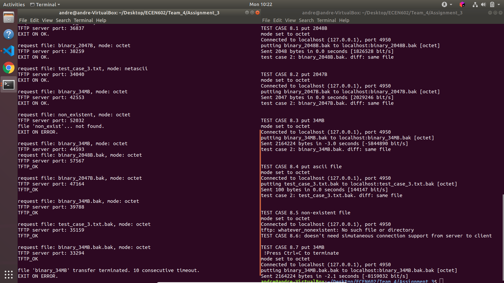

# TFTP Server

## Role of Team Members

* Luming Xu
  + RRQ
  + `run_server.sh` : creates test files and folders
  + `launch_tests.sh` : runs test cases
  + Binary file test cases

* Akhilesh Rawat
  + WRQ
  + Ascii File transfer for WRQ and RRQ
  + Ascii file test cases

## Bonus Points

We implement the WRQ feature in the server. The client can write both binary and ascii files to the server and retrieve them later. The files maintain their format and are identical to the line endings as is desired. We test the following features:

  + transfer binary files of sizes 2047B, 2048B and 3MB from client to the server and retrieve them later
  + transfer ascii files with different line endings from client to the server and retrieve them later
  + timeout if the client disconnects while transfer
  + simultaneous writes to the server.
  + error if the file already exists at the server

## Program Architecture

* On a RRQ or WRQ request from a client, the server creats a child process for each request. This way the server is able to handle multiple client RRQ  and WRQ requests and transmit simutaneously.

* `lib.c` provides with construction and parse APIs for various packet types.
* Various server parameters can be configured with `config.h` .

* Block number wrap around is implemented by utilizing overflow of `uint16_t` .

* Error packets are replied to the client when the requested file name doesn't exist under the tftp server folder or if the client attempts to write a file which already exists.

* Packet timeout is implemented by using timer tv in the select call of the child process. When 10 consecutive timeout happens, the server replies with an ERROR packet, and terminates the corresponding child process.

* For ascii files, the server recognizes the mode and reads and writes the files accordingly by updating line endings to preserve the file format. The `read_block` and `write_data_to_file` implement the relevant logic.

## Execution Guide

1.execute `run_server.sh` 

2.execute `launch_tests.sh` 

### Notes on execution

*  Shell scripts are written to automatically go through test cases.

* Script `run_server.sh` launches the TFTP server, and generate test files under test folder.

* Script `launch_tests.sh` send TFTP client requests to TFTP server, and use `cmp` system call to compare source and destination files.

*  Note that termination of transfer need manual action, by timely pressing Ctrl+C when prompted.

*  Test case 6 (simutaneous transfer) is tested and screenshot posted separately.

## Test Cases

* screenshots have all the test cases included (including bonus features).

### Test cases 1 to 7


### Test case 6


### Bonus Feature Test cases 8.1 to 8.7



## Source Code

### run_server.sh

``` shell
# server shell

clear

BASEDIR=$PWD

rm -r $BASEDIR/test/

# create test folder, included in .gitignore
test_folder=$BASEDIR/test
if [ ! -d "$test_folder" ]; then
    mkdir $test_folder
fi

server_folder=$test_folder/server
# check server folder existence
if [ ! -d "$server_folder" ]; then
    mkdir $server_folder
fi

# test case 1: 2048 Bytes
base64 /dev/urandom | head -c 2K >$server_folder/binary_2048B
# test case 2: 2047 Bytes
base64 /dev/urandom | head -c 2047 >$server_folder/binary_2047B
# test case 3: text file with several CRs, copy from main folder
cp $BASEDIR/test_case_3.txt $server_folder/test_case_3.txt
# test case 4: 34 MB
base64 /dev/urandom | head -c 34MB >$server_folder/binary_34MB
echo "test files generated."

make clean
make
retval=$? # store retval of make

if [ $retval -eq 0 ]; then # make without error
    mv ./server $server_folder # move server to test directory
    cd $server_folder
    pwd
    ./server 4950 # launch server
else
    echo MAKE ERROR.
fi

```

### launch_tests.sh

``` shell
# client shell

clear

BASEDIR=$PWD
# create test folder, included in .gitignore
test_folder=$BASEDIR/test
if [ ! -d "$test_folder" ]; then
    mkdir $test_folder
fi

client_folder=$test_folder/client
server_folder=$test_folder/server

# check existence, then move to testing folder
if [ -d "$client_folder" ]; then
    cd $client_folder
else
    mkdir $client_folder
    cd $client_folder
fi

# test case 1
echo -e "TEST CASE 1"
file_name=binary_2048B
tftp localhost 4950 -v -m binary -c get $file_name
# compare files
cmp $client_folder/$file_name $server_folder/$file_name
retval=$?
if [ $retval -eq 0 ]; then
    echo -e "test case 1: $file_name. diff: same file\n"
fi

# test case 2
echo -e "TEST CASE 2"
file_name=binary_2047B
tftp localhost 4950 -v -m binary -c get $file_name
# compare files
cmp $client_folder/$file_name $server_folder/$file_name
retval=$?
if [ $retval -eq 0 ]; then
    echo -e "test case 2: $file_name. diff: same file\n"
fi

# test case 3
echo -e "TEST CASE 3"
file_name=test_case_3.txt
tftp localhost 4950 -v -m ascii -c get $file_name
# compare files
cmp $client_folder/$file_name $server_folder/$file_name
retval=$?
if [ $retval -eq 0 ]; then
    echo -e "test case 2: $file_name. diff: same file\n"
fi

# test case 4
echo -e "TEST CASE 4"
file_name=binary_34MB
tftp localhost 4950 -v -m binary -c get $file_name
# compare files
cmp $client_folder/$file_name $server_folder/$file_name
retval=$?
if [ $retval -eq 0 ]; then
    echo "test case 4: $file_name. diff: same file"
    echo ""
fi

# test case 5
echo -e "TEST CASE 5"
file_name=non_existent
tftp localhost 4950 -v -m binary -c get $file_name

# test case 6
echo -e "\nTEST CASE 6: see local screenshot\n"

# test case 7
echo -e "TEST CASE 7"
file_name=binary_34MB
# test the behavior of server when client disconnects in the middle of transmission
echo "!Press Ctrl+C for test case 7"
tftp localhost 4950 -v -m binary -c get $file_name
echo "should see timeout on server termiinal"

# rename local client files to different names, to avoid filename collision

# test case 8.1
echo -e "\nTEST CASE 8.1 put 2048B"
mv binary_2048B binary_2048B.bak
file_name=binary_2048B.bak
tftp localhost 4950 -v -m binary -c put $file_name
cmp $client_folder/$file_name $server_folder/$file_name
retval=$?
if [ $retval -eq 0 ]; then
    echo -e "test case 2: $file_name. diff: same file\n"
fi

# test case 8.2
echo -e "\nTEST CASE 8.2 put 2047B"
mv binary_2047B binary_2047B.bak
file_name=binary_2047B.bak
tftp localhost 4950 -v -m binary -c put $file_name
cmp $client_folder/$file_name $server_folder/$file_name
retval=$?
if [ $retval -eq 0 ]; then
    echo -e "test case 2: $file_name. diff: same file\n"
fi

# test case 8.3
echo -e "\nTEST CASE 8.3 put 34MB"
mv binary_34MB binary_34MB.bak
file_name=binary_34MB.bak
tftp localhost 4950 -v -m binary -c put $file_name
cmp $client_folder/$file_name $server_folder/$file_name
retval=$?
if [ $retval -eq 0 ]; then
    echo -e "test case 2: $file_name. diff: same file\n"
fi

# test case 8.4
echo -e "\nTEST CASE 8.4 put ascii file"
mv test_case_3.txt test_case_3.txt.bak
file_name=test_case_3.txt.bak
tftp localhost 4950 -v -m binary -c put $file_name
cmp $client_folder/$file_name $server_folder/$file_name
retval=$?
if [ $retval -eq 0 ]; then
    echo -e "test case 2: $file_name. diff: same file\n"
fi

# test case 8.5
echo -e "\nTEST CASE 8.5 non-existent file"
tftp localhost 4950 -v -m binary -c put whatever_nonexistent

# test case 8.6
echo -e "TEST CASE 8.6: doesn't need simutaneous connection support from server to client"

# test case 8.7
echo -e "\nTEST CASE 8.7 put 34MB\n !Press Ctrl+C to terminate"
mv binary_34MB.bak binary_34MB.bak.bak
file_name=binary_34MB.bak.bak
tftp localhost 4950 -v -m binary -c put $file_name

```

### server.c

``` c
#include "config.h"
#include "lib.h"

void sigchld_handler(int s) {
    // waitpid() might overwrite errno, so we save and restore it:
    int saved_errno = errno;
    while(waitpid(-1, NULL, WNOHANG) > 0);
    errno = saved_errno;
}

tftp_err_t main(int argc, char *argv[]) {

  struct sigaction sa;

  if (argc != 2) {
    printf("usage: ./server port\n");
    return 1;
  }
  // TODO: add port param check
  char *port;
  port = argv[1];

  char buf_recv[MAXBUFLEN];
  int listen_fd;
  size_t numbytes;
  opcode_t opcode;
  struct sockaddr client_addr;

  /* initialize the server */
  if (init(port, &listen_fd) == TFTP_FAIL) {
    printf("INIT FAILED.\n");
    return TFTP_FAIL;
  }

  // reap_dead_processes
  sa.sa_handler = sigchld_handler;
  sigemptyset(&sa.sa_mask);
  sa.sa_flags = SA_RESTART;
  if (sigaction(SIGCHLD, &sa, NULL) == -1) {
    perror("sigaction");
    exit(1);
  }

  while (1) {
    tftp_recvfrom(listen_fd, buf_recv, &numbytes, &client_addr); 
    
    if (!fork()) {
      // child process
      close(listen_fd); // close listening socket in child process

    	if (DEBUG) {
    		printf("[Packet size] %ld\n", numbytes);
    		printf("[Packet content] : \n" );
    		for (int i = 0; i < numbytes; i++) {
    			printf(" [%d]:", i);
    			printf(" %d %c\n",buf_recv[i], buf_recv[i]);
    		} 
    	}

      parse_header(buf_recv, &opcode);
      if (opcode == RRQ) {
        if (rrq_handler(buf_recv, numbytes, client_addr) == TFTP_OK) {
          printf("EXIT ON OK.\n\n");
        } else {
          printf("EXIT ON ERROR.\n\n");
        }
      }
      if (opcode == WRQ) {
        // TODO: add WRQ handling
        if (wrq_handler(buf_recv, numbytes, client_addr) == TFTP_OK) {
          printf("TFTP_OK\n\n");
        } else {
          printf("TFTP_FAIL\n\n");
        }
        // printf("WRQ not handled.\n");
      }
      exit(0);
    } else {
      // parent process
      continue;
    }
  }

  close(listen_fd);
  return TFTP_OK;
}
```

### Makefile

``` Makefile
C = gcc
DEPS = config.h lib.h 

TARGETS = server 

all: $(TARGETS)

server: server.o lib.o $(DEPS) 
	$(C) -o server server.o lib.o 

clean:
	rm -f *.o server  

```

### lib.c

``` c
#include "lib.h"
// ------- START OF INNER UTIL FUNCTIONS ------------
void *get_in_addr(struct sockaddr *sa) {
  if (sa->sa_family == AF_INET) {
    return &(((struct sockaddr_in *)sa)->sin_addr);
  }
  return &(((struct sockaddr_in6 *)sa)->sin6_addr);
}

// given sockfd, return local port
tftp_err_t get_sock_port(int sockfd, int *local_port) {
  struct sockaddr_in sin;
  int addrlen = sizeof(sin);
  if (getsockname(sockfd, (struct sockaddr *)&sin, &addrlen) == 0 &&
      sin.sin_family == AF_INET && addrlen == sizeof(sin)) {
    *local_port = ntohs(sin.sin_port);
    return TFTP_OK;
  } else {
    printf("find port error.\n");
    return TFTP_FAIL;
  }
}

// print buffer of given length in hexadecimal form, prefix with 0
void print_hex(void *array, size_t len) {
  char *parray = array;
  for (int i = 0; i < len; i++) {
    printf(" %02x", parray[i]);
  }
  printf("\n");
}

char nextchar = -1;

// given block_num, read file to buffer
int read_block(FILE **fp, uint16_t block_num, char *buf, char *mode) {
  if (!strcmp(mode, "netascii")) {
    size_t numbytes;

    // size_t numbytes = fread(buf, 1, MAXBUFLEN, *fp);
    char c;
    for (numbytes = 0; numbytes < MAXBUFLEN; numbytes++) {

      if (nextchar >= 0) {  
        *buf++ = nextchar;
        nextchar = -1;
        continue;
      }
      
      c = getc(*fp);

      if (c == EOF) {
        if (ferror(*fp)) {
          // read error
          printf("READ ERROR FROM GETC ON LOCAL FILE\n");
        }
        return numbytes;
      } else if (c == '\n') {
        c = '\r';
        nextchar = '\n';

      } else if (c == '\r') {
        nextchar  = '\0';

      } else 
        nextchar = -1;

      *buf++ = c;

    }

    return numbytes;
  } else if (!strcmp(mode, "octet")) {
    size_t numbytes = fread(buf, 1, MAXBUFLEN, *fp);
    // TODO: #block print disabled for performance issue
    // printf("#block: %d, size: %ld\n", block_num, numbytes);
    return numbytes;
  } else {
    return -1;
  }
}

// get connected peer (remote) IP address port number
void get_peer_info(int sockfd, struct sockaddr_storage addr) {
  // assume s is a connected socket

  socklen_t len = sizeof addr;
  char ipstr[INET6_ADDRSTRLEN];
  int port;

  getpeername(sockfd, (struct sockaddr *)&addr, &len);

  // deal with both IPv4 and IPv6:
  if (addr.ss_family == AF_INET) {
    struct sockaddr_in *s = (struct sockaddr_in *)&addr;
    port = ntohs(s->sin_port);
    inet_ntop(AF_INET, &s->sin_addr, ipstr, sizeof ipstr);
  } else { // AF_INET6
    struct sockaddr_in6 *s = (struct sockaddr_in6 *)&addr;
    port = ntohs(s->sin6_port);
    inet_ntop(AF_INET6, &s->sin6_addr, ipstr, sizeof ipstr);
  }

  // if (DEBUG) {
  //   printf("Peer IP address: %s\n", ipstr);
  //   printf("Peer port      : %d\n", port);
  // }
}

// copy error packet to buffer, handle endian issue
tftp_err_t error_to_buffer(char *buf_send, tftp_error_packet_t error_packet) {
  off_t offset = 0;
  uint16_t big_endian = bswap_16(error_packet.opcode);
  memcpy(buf_send, &big_endian, sizeof(big_endian));
  offset += sizeof(error_packet.opcode);

  big_endian = bswap_16(error_packet.error_code);
  memcpy(buf_send + offset, &big_endian, sizeof(big_endian));
  offset += sizeof(error_packet.error_code);

  memcpy(buf_send + offset, error_packet.error_msg,
         sizeof(error_packet.error_msg));
  return TFTP_OK;
}

//  given error code and error message, write to buffer
// TODO: add other possible error code logic
tftp_err_t make_error_packet(error_code_t error_code, char *error_msg,
                             char *buf_send) {
  tftp_error_packet_t error_packet = {0};
  error_packet.opcode = ERROR;
  error_packet.error_code = error_code;
  strcpy(error_packet.error_msg, error_msg);
  error_to_buffer(buf_send, error_packet);

  return TFTP_OK;
}

// copy struct to buffer, handle endian issue
tftp_err_t data_to_buffer(char *buf_send, tftp_data_packet_t data_packet) {
  off_t offset = 0;
  uint16_t big_endian = bswap_16(data_packet.opcode);
  memcpy(buf_send, &big_endian, sizeof(big_endian));
  offset += sizeof(data_packet.opcode);

  big_endian = bswap_16(data_packet.block_num);
  memcpy(buf_send + offset, &big_endian, sizeof(big_endian));
  offset += sizeof(data_packet.block_num);

  memcpy(buf_send + offset, data_packet.payload, sizeof(data_packet.payload));
  return TFTP_OK;
}

char _nextchar = -1;

size_t write_data_to_file(FILE **fd, char *buf, size_t _numbytes, char *mode) {
  if (!strcmp(mode, "netascii")) {
    size_t numbytes;
    // numbytes = fwrite(buf, 1, _numbytes, *fd);

    char c;
    for (numbytes = 0; numbytes < _numbytes; numbytes++) {

      if (_nextchar >= 0) {  
        // *buf++ = nextchar;
        putc(_nextchar, *fd);
        _nextchar = -1;
        continue;
      }
      
      c = buf[numbytes];

      if (c == EOF) {
        return numbytes;
      } else if (c == '\r') {
        if (buf[numbytes+1] == '\0') {
          numbytes++;
        } else if (buf[numbytes+1] == '\n') {
          c = '\n';
          numbytes++;
        }
      } else 
        _nextchar = -1;

      // *buf++ = c;
      putc(c, *fd);

    }

    return numbytes;
  } else if (!strcmp(mode, "octet")) {
    size_t numbytes = fwrite(buf, 1, _numbytes, *fd);
    // printf("buf size written:%lu\n", num_bytes);
    return numbytes;
  } else {
    return -1;
  }
}

// read from fp into buf_send, numbytes read returned for EOF decision
tftp_err_t make_data_packet(FILE **fp, uint16_t block_num, char *buf_send,
                            size_t *numbytes, char *mode) {
  tftp_data_packet_t data_packet = {0};
  data_packet.opcode = DATA;
  data_packet.block_num = block_num;
  *numbytes = read_block(fp, block_num, data_packet.payload, mode); 

  if (*numbytes == -1) {
    // error in local file read
    return TFTP_FAIL;
  }

  data_to_buffer(buf_send, data_packet);

  return TFTP_OK;
}

// prepare to be sent on the network
tftp_err_t ack_to_buffer(char *buf_send, tftp_ack_packet_t ack_packet) {
  off_t offset = 0; 
  uint16_t big_endian = bswap_16(ack_packet.opcode);
  memcpy(buf_send, &big_endian, sizeof big_endian);
  offset += sizeof(ack_packet.opcode);

  big_endian = bswap_16(ack_packet.block_num);
  memcpy(buf_send + offset, &big_endian, sizeof big_endian);
  // printf("ack:\n");
  // print_hex(buf_send, sizeof(buf_send));

  return TFTP_OK;
}

// create an ack with the block num
tftp_err_t make_ack_packet(char *buf_send, uint16_t block_num) {
  tftp_ack_packet_t ack_packet = {0};
  ack_packet.opcode = ACK;
  ack_packet.block_num = block_num; 

  ack_to_buffer(buf_send, ack_packet);
  return TFTP_OK;
}

// opcode is verified in the packet router
// compare if ack to the same block_num counter
tftp_err_t parse_ack_packet(char *buf_recv, uint16_t block_num) {
  tftp_ack_packet_t *ack_packet = (tftp_ack_packet_t *)buf_recv;

  if (bswap_16(ack_packet->block_num) == block_num) {
    // TODO: ACK print disabled
    // printf("ACK on block: %d\n", bswap_16(ack_packet->block_num));
    return TFTP_OK;
  } else {
    printf("WRONG BLOCK NUM: %d. Expect: %d\n", bswap_16(ack_packet->block_num),
           block_num);
    return TFTP_FAIL;
  }
}

tftp_err_t parse_data_packet(char *buf, uint16_t *block_num, size_t *numbytes) {
  tftp_data_packet_t *data_packet = (tftp_data_packet_t *) buf;

  // ntoh order
  *block_num = bswap_16(data_packet->block_num);
  memcpy(buf, data_packet->payload, *numbytes);
  return TFTP_OK;
}

// given buffer and length, return filename and mode
tftp_err_t parse_trail_buf(char *buf, size_t len_buf, char *filename,
                     char *mode) {
  /* trailing buffer now has filename and the mode. According to RFC, the file
        name is followed by a 0. Locate that 0 */
  tftp_header_t *tftp_header = (tftp_header_t *)buf;

  char *pos_ptr = strchr(tftp_header->trail_buf, 0);
  /* in case pos reaches the end of the file, it's a problem */
  int pos = (pos_ptr == NULL ? -1 : pos_ptr - tftp_header->trail_buf);

  if (pos < 0) {
    perror("filename not valid\n");
    return TFTP_FAIL;
  }

  /* extract filename from the trail buffer */
  memcpy(filename, tftp_header->trail_buf, pos);

  /* rest of the buffer has mode */
  memcpy(mode, &(tftp_header->trail_buf[pos + 1]), 8 * sizeof(char));

  printf("request file: %s, mode: %s\n", filename, mode);
  return TFTP_OK;
}

// given file name and mode, open file, 
tftp_err_t open_file(FILE **fp, char *filename, char *mode) {
  *fp = fopen(filename, mode);
  if (*fp == NULL) {
    printf("file: %s. open failed.\n", filename);
    return TFTP_FAIL;
  } else {
    return TFTP_OK;
  } 
}

// ------- END OF INNER UTIL FUNCTIONS ------------

// launch DGRAM socket at given port. port = "" results in ephemeral port.
tftp_err_t init(char *port, int *sockfd) {
  int rv, numbytes;
  struct addrinfo hints, *servinfo, *p;

  memset(&hints, 0, sizeof hints);

  hints.ai_family = AF_UNSPEC; // set to AF_INET to force IPv4
  hints.ai_socktype = SOCK_DGRAM;
  hints.ai_flags = AI_PASSIVE; // use my IP

  if ((rv = getaddrinfo(NULL, port, &hints, &servinfo)) != 0) {
    fprintf(stderr, "getaddrinfo: %s\n", gai_strerror(rv));
    return TFTP_FAIL;
  }

  // loop through all the results and bind to the first we can
  for (p = servinfo; p != NULL; p = p->ai_next) {
    if ((*sockfd = socket(p->ai_family, p->ai_socktype, p->ai_protocol)) ==
        -1) {
      perror("listener: socket");
      continue;
    }
    if (bind(*sockfd, p->ai_addr, p->ai_addrlen) == -1) {
      close(*sockfd);
      perror("listener: bind");
      continue;
    }
    break;
  }
  if (p == NULL) {
    return TFTP_FAIL;
  }

  freeaddrinfo(servinfo);
  int local_port;
  get_sock_port(*sockfd, &local_port);
  printf("TFTP server port: %d\n", local_port);
  return TFTP_OK;
}

tftp_err_t tftp_recvfrom(int sockfd, char *buf, size_t *numbytes,
                         struct sockaddr *their_addr) {
  // char s[INET6_ADDRSTRLEN] = {0};
  socklen_t addr_len = sizeof their_addr;

  // accouting for maximum data receivable
  if ((*numbytes = recvfrom(sockfd, buf, DATA_PACKET_LEN, 0, their_addr,
                            &addr_len)) == -1) {
    perror("recvform");
    return TFTP_FAIL;
  }
  get_peer_info(sockfd, *(struct sockaddr_storage *)their_addr);

  return TFTP_OK;
}

tftp_err_t parse_header(char *buf, opcode_t *opcode) {
  tftp_header_t *tftp_header = (tftp_header_t *)buf;
  /* extract opcode */
  *opcode = bswap_16(tftp_header->opcode);
  return TFTP_OK;
}

// given RRQ buffer, its length, and remote address, enter handling routine
tftp_err_t rrq_handler(char *buf, size_t numbytes,
                       struct sockaddr client_addr) {
  char buf_send[516] = {0}, buf_recv[516] = {0}, error_msg[128] = {0},
       filename[MAX_FILE_NAME] = {0}, mode[8] = {0};

  // mode: netascii, octet or mail, should never exceed 8 bytes

  bool is_EOF = 0; // if is last data block, send 1 less byte
  // local block num counter, pass to file read, verify on ACK
  // use uint16_t for natural rollover when overflow
  uint16_t block_num = 1;
  int sockfd;
  // tftp_mode_t mode;
  opcode_t opcode;
  int timeout_counter = 0;
  FILE *fp;
  fd_set readfds;
  struct timeval tv;

  if (parse_trail_buf(buf, numbytes, filename, mode) != TFTP_OK) {
    printf("RRQ PARSE ERROR.\n");
    return TFTP_FAIL;
  }

  if (init("", &sockfd) != TFTP_OK) { // create with an ephemeral port
    printf("INIT FAIL.\n");
    return TFTP_FAIL;
  }

  if (access(filename, F_OK) == -1) { // file doesn't exist
    char copy_fn[10];
    strncpy(copy_fn, filename, 10);
    copy_fn[9] = '\0'; // trunc it to 10, else filename >> error_msg   
    sprintf(error_msg, "file '%s'... not found.", copy_fn);

    printf("%s\n", error_msg);
    make_error_packet(FILE_NOT_FOUND, error_msg, buf_send);
    sendto(sockfd, buf_send, sizeof(buf_send), 0, &client_addr,
           sizeof(client_addr));
    return TFTP_FAIL; // early return
  }

  if (open_file(&fp, filename, "r") != TFTP_OK) {
    printf("OPEN FILE FAIL!.\n");
    // TODO: reply with error packet.
    return TFTP_FAIL;
  };

  if (DEBUG) {
    fseek(fp, 0, SEEK_END);
    off_t size = ftell(fp); // long int, get file size
    printf("filename: %s, size: %ld\n", filename, size);
    fseek(fp, 0, SEEK_SET);
  }

  while (1) {
    make_data_packet(&fp, block_num, buf_send, &numbytes, mode);
    // if read less than 512 bytes of data, reached EOF
    is_EOF = (numbytes < MAXBUFLEN);

    sendto(sockfd, buf_send, 4 + numbytes, 0, &client_addr,
           sizeof(client_addr));
    tv.tv_sec = TIMEOUT;
    tv.tv_usec = 0;
    FD_ZERO(&readfds);
    FD_SET(sockfd, &readfds);
    if (select(sockfd + 1, &readfds, NULL, NULL, &tv) == 0) {
      timeout_counter += 1;
      if (timeout_counter == MAX_RETRY) {
        // disconnect on 10 consecutive timeout
        close(sockfd);
        printf("file '%s' transfer terminated. %d consecutive timeout.\n", filename, MAX_RETRY);
        return TFTP_FAIL;
      }
      continue; // skip below routine, try to resend
    };

    // select(sockfd,)
    tftp_recvfrom(sockfd, buf_recv, &numbytes, &client_addr);
    parse_header(buf_recv, &opcode);

    if (opcode != ERROR && opcode != ACK) { // deal with trivial error case
      // take no action on other packets, make disconnect decision from timeout
      printf("UNKNOWN PACKET\n");
    }
    if (opcode == ERROR) {
      printf("ERROR PACKET\n");
      return TFTP_FAIL; // end of routine on FAIL
    }
    if (opcode == ACK) {
      if (parse_ack_packet(buf_recv, block_num) == TFTP_OK) {
        block_num += 1;
        if (is_EOF) {     // received final ACK
          close(sockfd);  // tftp sends get to well-known port each time.
          return TFTP_OK; // end of routine on success
        }
      } else { // wrong block number
        printf("WRONG #BLOCK.\n");
      }
    }
  } // end of while loop
} // end of rrq handler routine

// handle write request to the server
tftp_err_t wrq_handler(char *buf, size_t numbytes, struct sockaddr client_addr) {

	char buf_send[516] = {0}, buf_recv[516] = {0}, error_msg[128] = {0},
				filename[MAX_FILE_NAME] = {0}, mode[8] = {0};
        
  // mode: netascii, octet or mail, should never exceed 8 bytes

	uint16_t block_num = 0, last_block_ack = 0;
  int sockfd, timeout_counter = 0;
  opcode_t opcode;
  FILE *fd;
  fd_set readfds;
  struct timeval tv;
  int _EOF = 0;

  // parse the trailing buf and return filname and mode
  if (parse_trail_buf(buf, numbytes, filename, mode) != TFTP_OK) {
    printf("WRQ PARSE ERROR. \n");
    return TFTP_FAIL;
  }

  if (init("", &sockfd) != TFTP_OK) {
    printf("INIT FAIL. \n");
    return TFTP_FAIL;
  }

  if(access(filename, F_OK) != -1) {
    // file exists
    char copy_fn[10];
    strncpy(copy_fn, filename, 10);
    copy_fn[9] = '\0';
    sprintf(error_msg, "file '%s'... already exists.", copy_fn);

    printf("%s\n", error_msg);
    make_error_packet(FILE_EXISTS, error_msg, buf_send);
    // inform the client
    sendto(sockfd, buf_send, sizeof(buf_send), 0, &client_addr, sizeof(client_addr)); 
    return TFTP_FAIL;
  }

  // open file for write
  if (open_file(&fd, filename, "a") != TFTP_OK) {
    printf("FILE WRITE FAIL!\n");
    // TODO: reply with error packet.
    return TFTP_FAIL;
  }

  while(1) {
    if (make_ack_packet(buf_send, block_num) != TFTP_OK) {
      printf("server: ACK not sent. Connection failed.\n");
    } 

    if (sendto(sockfd, buf_send, 4, 0, &client_addr, sizeof client_addr) == -1) {
      printf("server: ACK not sent, Connection failed\n");
    } 

    // update block ack 
    last_block_ack = block_num;

    if (DEBUG)
      printf("last_block_ack:%d\n", last_block_ack);

    if (_EOF) {
      // safely return
      close(sockfd);
      return TFTP_OK;
    }

    tv.tv_sec = TIMEOUT;
    tv.tv_usec = 0;
    FD_ZERO(&readfds);
    FD_SET(sockfd, &readfds);
    if (select(sockfd + 1, &readfds, NULL, NULL, &tv) == 0) {
      timeout_counter += 1;
      if (timeout_counter == MAX_RETRY) {
        // disconnect on MAX_RETRY attempts
        close(sockfd);
        printf("file '%s' transfer terminated. %d consecutive timeout.\n", filename, MAX_RETRY);
        return TFTP_FAIL;
      } else {
        continue;
      }
    }

    // client will send the next data packet if recieved an ACK
    tftp_recvfrom(sockfd, buf_recv, &numbytes, &client_addr);

    if (DEBUG)
      printf("recvfrom numbytes: %lu\n", numbytes);
    // parse recieved packet
    parse_header(buf_recv, &opcode);

    // opcode should be either DATA or ERROR at this point
    if ((opcode != DATA) && (opcode != ERROR)) {
      printf("UNKNOWN PACKET\n");
      return TFTP_FAIL;
    }

    if (opcode == ERROR) {
      printf("ERROR PACKET\n");
      return TFTP_FAIL;
    }

    if (opcode == DATA) {
      numbytes -= 4;      // accouting for opcode and block number
      if (parse_data_packet(buf_recv, &block_num, &numbytes) == TFTP_OK) {

        if (DEBUG)
          printf("block Number:%d\n", block_num);

        if (block_num > last_block_ack) {
          write_data_to_file(&fd, buf_recv, numbytes, mode);
        } else {
          // Duplicate Frame Recieved, Send an ACK again
        }
        if (numbytes < MAXBUFLEN) {
          _EOF = 1;
        }
      }
    }
  } 
}

```

### lib.h

``` c
#ifndef LIB_H_
#define LIB_H_

#include "config.h"

/* types of tftp packets */
typedef enum opcode_t {
  RRQ = 1,
  WRQ = 2,
  DATA = 3,
  ACK = 4,
  ERROR = 5
} opcode_t;

// status code of lib function return value
typedef enum tftp_err_t { TFTP_OK = 0, TFTP_FAIL = -1 } tftp_err_t;

// error code of ERROR packet
// when return from function, use negative number of corresponding enum
typedef enum error_code_t {
  UNDEFINED = 0,
  FILE_NOT_FOUND = 1,
  ACCESS_VIOLATION = 2,
  DISK_FULL = 3,
  ILLEGAL_OP = 4,
  UNKNOWN_TID = 5,
  FILE_EXISTS = 6,
  NO_SUCH_USER = 7,
} error_code_t;

typedef struct tftp_header_t {
  uint16_t opcode;
  char trail_buf[MAXBUFLEN];
} tftp_header_t;

typedef struct tftp_data_packet_t {
  uint16_t opcode;
  uint16_t block_num;
  char payload[512];
} tftp_data_packet_t;

typedef struct tftp_error_packet_t {
  uint16_t opcode;
  uint16_t error_code;
  char error_msg[128];
  uint8_t trailing_zero; // empty byte from the spec
} tftp_error_packet_t;

typedef struct tftp_ack_packet_t {
  uint16_t opcode;
  uint16_t block_num;
} tftp_ack_packet_t;

// launch DGRAM socket at given port. 
// port = "" results in ephemeral port.
tftp_err_t init(char *port, int *sockfd);

// return buf, numbytes, and remote address
tftp_err_t tftp_recvfrom(int sockfd, char *buf, size_t *numbytes,
                         struct sockaddr *their_addr);

// given buffer , return opcode from its header
tftp_err_t parse_header(char *buf, opcode_t *opcode);

// given RRQ buffer, its length, and remote address, enter handling routine
tftp_err_t rrq_handler(char *buf, size_t numbytes, struct sockaddr client_addr);

tftp_err_t wrq_handler(char *buf, size_t numbytes, struct sockaddr client_addr);

#endif
```

### config.h

``` c
#ifndef CONFIG_H_ 
#define CONFIG_H_ 

#include <stdio.h>
#include <stdlib.h>
#include <string.h>

#include <arpa/inet.h>
#include <errno.h>
#include <netdb.h>
#include <netinet/in.h>
#include <signal.h>
#include <stdbool.h>
#include <sys/socket.h>
#include <sys/time.h>
#include <sys/types.h>
#include <sys/wait.h>
#include <unistd.h>
#include <fcntl.h>
#include <sys/stat.h>
#include <byteswap.h>
#include <signal.h>

#define DEBUG 0 

#define MAX_CLIENTS 5
#define MAXBUFLEN 512 
#define MAX_FILE_NAME 255
#define DATA_PACKET_LEN 516 // opcode + #block + payload = 2 + 2 + 512 = 516
#define TIMEOUT 1 // 1 second timeout on select
#define MAX_RETRY 10
#endif
```

