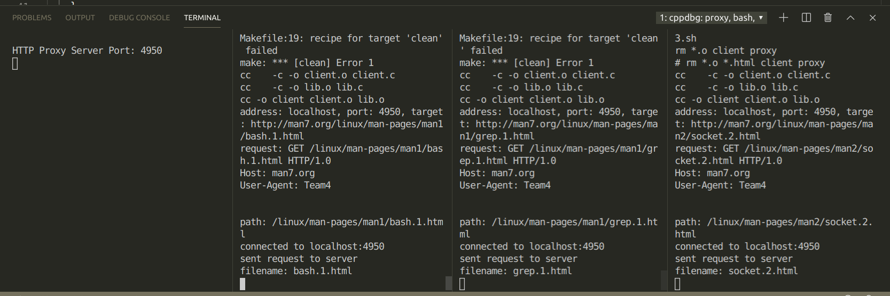

# HTTP Proxy

## Team 4

## Contribution

- Akhilesh: **Client, request and response parsers**
- Luming: **Server, Cache**

## File Structure 

- `client.c`: Contains the HTTP client code
- `proxy.c`: Contains the HTTP proxy server code
- `config.h`: Contains configuration params
- `lib.h`: utility functions used across cache, proxy server and client.

## to run

- with `run_proxy.sh` and `run_client.sh`
  - the destination address can be changed in the `run_client.sh` script.

- with `./proxy <ip to bind> <port to bind>` to run the proxy
- with `./client <proxy address> <proxy port> <URL to rerieve>` to run the client.

## Bonus Points Implemented

- Yes
* If the client request url results in a cache miss, a normal GET is sent.
* If the client request url results in a cache hit, a CONDITIONAL GET is sent with `If-Modified-Since` header field, filled with the last received `Date` value.  
    * If server response is of status code `304 Not Modified`, then the `Date` field recorded in the cache is updated to the latest received time, and the document is sent to client directly from the cache.
    * If server response is of any other status code, then the proxy server reacts accordingly, as is specified in `RFC1945 page 42-43`
* As is stated in the Bonus section, `"You can also cache a document in the proxy that is missing both Expires and Last-Modified headers"`, thus the proxy server is implemented to cache each response and check with conditional get if a cache hit ever occurs.
## Architecture

### Client

The client accepts the proxy address and port, and the destination target url as 
command line args. The client can parse the destination target url passed to it in any of the
following forms and create the correct request:

- `www.cpluscplus.com`
- `www.cpluscplus.com/some`
- `https://www.cpluscplus.com`
- `https://www.cpluscplus.com/some`

For now, we pass the host, path and user-agent in our request. Adding more fields
is trivial.

### Cache

* Our cache structure is detailed in `lib.h`. It is a doubly linked list, whose every node serves as a cache unit. Apart from relevant pointers, each node stores cache status for that node, stored response size and http header information. We also have cache print utility functions.

* During initialization of cache queue, 10 dummy nodes are filled in, thus queue remains a constant size when performing eviction and enqueue.  

### Proxy server
The proxy server maintains a record of clients connected to it simultaneously. The
assigned file descriptors are stored in another doubly linked list. We
use `select()` call to serve current connections and accept new ones. During a 
connection request from a client, the proxy server first parses the request for URL
to get the hostname and the path. To retrieve more fields, the parser can be modified which
is trivial. We then check for a similar entry in our cache. If found and
valid, the proxy server responds back to the client with the same. Otherwise, it sends the
request received to the destination url and waits for the response and caches it for it
to serve later on a similar request. 


## Test cases

- **TEST CASE 1**: A cache hit returns the saved data to the requester


- **TEST CASE 2**: A request that is not in the cache is proxied, saved in the cache and returned to the requester


- **TEST CASE 3**: A cache miss with 10 items already in the cache is proxied, saved in the LRU location in cache, and the data is returned to the requester

#### cache state before cache miss
* sctp.7.html as first node
* send.2.html as last node


#### cache state after cache miss and enqueue
* sctp.7.html as second node,
* cache miss item epoll.7 as first node
* send.2.html evicted from the queue


- **TEST CASE 4**: (Modified according to bonus feature) This test case is not necessary in a conditional get architecture. 
~~A stale `Expires` header in the cache is accessed, the cache entry is replaced with a fresh copy, and the fresh data is delivered to the requester~~

- **TEST CASE 5**: (Modified according to bonus feature) A cache hit entry verified by CONDITIONAL GET with 200 response is replaced with new content, then sent to the client

~~A stale entry in the cache without an `Expires` header is determined based on the last Web server access time and last modification time, the stale cache entry is replaced with fresh data, and the fresh data is delivered to the requester~~

- **TEST CASE 6**: (Modified according to bonus feature) A cache hit entry verified by CONDITIONAL GET with 304 response is sent to the client.

~~A cache entry without an `Expires` header that has been previously accessed from the Web server in the last 24 hours and was last modified more than one month ago is returned to the requester~~

* return cache item with 304 as response status code


- **TEST CASE 7**: Three clients can simultaneously access the proxy server and get the correct data 
* three scripts are added to request for long manual pages, namely run_client1.sh, run_client2.sh, and run_client3.sh



## Source Code
### Makefile
```c
all : client proxy

client : client.o lib.o
	cc -o client client.o lib.o

proxy : proxy.o lib.o
	cc -o proxy proxy.o lib.o


# lib_debug : lib.o
# 	gcc -g -c lib.c lib.o

proxy_debug: 
	gcc -g -c lib.c
	gcc -g proxy.c -o proxy lib.o

.PHONY : clean
clean :
	rm *.o client proxy 
	# rm *.o *.html client proxy 

```
### client.c
```c
#include "headers.h"
#include "lib.h"
http_err_t open_file(FILE **fp, char *filename, char *mode) {
  *fp = fopen(filename, mode);
  if (*fp == NULL) {
    printf("file: %s. open failed.\n", filename);
    return HTTP_FAIL;
  } else {
    return HTTP_OK;
  }
}
size_t write_data_to_file(FILE **fd, char *buf, size_t _numbytes,
                          off_t offset) {
  size_t numbytes;
  numbytes = fwrite(buf + offset, 1, _numbytes, *fd);
  return numbytes;
}

char *get_filename(char *str) {
  /* get the first token */
  const char separator[] = "/";
  char *token, *tmp;
  token = strtok(str, separator);

  /* walk through other tokens */
  while (token != NULL) {
    tmp = token;
    token = strtok(NULL, separator);
  }
  return tmp;
}

http_err_t main(int argc, char *argv[]) {
  if (argc != 4) {
    printf("usage: ./client <proxy address> <proxy port> <URL to rerieve>\n");
    return HTTP_FAIL;
  }
  http_err_t retval;

  // TODO:: validate args

  char *proxy_address = argv[1];
  char *proxy_port = argv[2];
  char *url;

  // this client supports all the possbile formats
  //  "www.cpluscplus.com";
  //  "www.cpluscplus.com/some";
  //  "https://www.cpluscplus.com";
  //  "https://www.cpluscplus.com/some";

  //  printf("address: %s, port: %s, target: %s\n", proxy_address, proxy_port,
  //  argv[3]);

  int _size = strlen(argv[3]);

  url = malloc(_size * sizeof(char));
  memcpy(url, argv[3], _size);

  int numbytes = 0;
  printf("address: %s, port: %s, target: %s\n", proxy_address, proxy_port, url);

  int sockfd = 0;

  char *path = malloc(_size * sizeof(char));
  char *host = malloc(_size * sizeof(char));
  char *_u = malloc(_size * sizeof(char));
  char *_p = malloc(_size * sizeof(char));
  char *loc;

  char buf_send[1500] = {0};
  char buf_recv[1500] = {0};
  char request[1500] = {0};

  loc = strchr(url, '/');
  int pos = (loc == NULL ? -1 : loc - url);

  // to fallback in case passed url does not start with https/http
  memcpy(_u, url, _size);

  if (pos > 0) {
    memcpy(_p, url, pos);
  }

  // if url began with https/http
  if (!strcmp(_p, "http:") || !strcmp(_p, "https:")) {
    // update _u
    memcpy(_u, &(url[pos + 2]), _size);
    // look for path in the rest
    loc = strchr(_u, '/');
    pos = (loc == NULL ? -1 : loc - _u);
  }

  if (pos > 0) {
    // we have our host address
    memcpy(host, _u, pos);
    memcpy(path, &(_u[pos]), _size);
  } else {
    // fall back to previous safe values
    strcpy(host, _u);
    strcpy(path, "/");
  }

  // add more fields if required
  sprintf(request, "GET %s HTTP/1.0\r\nHost: %s\r\nUser-Agent: Team4\r\n\r\n",
          path, host);

  char *filename = strdup(path);

  printf("request: %s\n", request);
  memcpy(buf_send, request, sizeof(request));
  printf("path: %s\n", path);

  if (server_lookup_connect(proxy_address, proxy_port, &sockfd) != HTTP_OK) {
    return HTTP_FAIL;
  }
  numbytes = written(sockfd, request, strlen(request) + 1);
  printf("sent request to server\n");
  filename = get_filename(filename);
  printf("filename: %s\n", filename);
  FILE *fp;
  open_file(&fp, filename, "a");

  // first recv treatment
  numbytes = readline(sockfd, buf_recv, MAX_DATA_SIZE);
  if (numbytes == 0) {
    printf("server disconnected!\n");
    return HTTP_FAIL;
  }
  http_info_t *http_info = calloc(1, sizeof(http_info_t));
  parse_response(buf_recv, http_info);
  int content_length = atoi(http_info->content_length);
  printf("content length: %d\n", content_length);

  char *entity_body_head = strstr(buf_recv, "\r\n\r\n");
  off_t offset = entity_body_head - buf_recv + 4;
  printf("offset: %ld\n", offset);
  numbytes = write_data_to_file(&fp, buf_recv + offset, numbytes - offset, 0);
  int count = numbytes;

  while (1) {
    numbytes = readline(sockfd, buf_recv, MAX_DATA_SIZE);
    if (numbytes == 0) {
      fclose(fp);
      break;
    } else {
      offset = 0;
      if (count + numbytes > content_length) {
        offset = count + numbytes - content_length;
        write_data_to_file(&fp, buf_recv, numbytes - offset, 0);
        fclose(fp);
        exit(0);
      } else {
        write_data_to_file(&fp, buf_recv, numbytes, 0);
        count += numbytes;
      }
      printf("written %ld bytes to file..\n", numbytes - offset);
    }
  }
  // printf("\n\nResponse:\n%s\n", buf_recv);
}

```

### proxy.c
```c
#include "headers.h"

http_err_t main(int argc, char *argv[]) {
  if (argc != 3) {
    printf("usage: ./proxy <ip to bind> <port to bind>\n");
    return HTTP_FAIL;
  }
  // cache_init_test();
  // cache_enqueue_test();
  // cache_eviction_test();
  // fd_list_test();
  // return HTTP_OK;

  char *proxy_ip = argv[1], *proxy_port = argv[2];
  int listen_fd;
  int retval;
  int client_fd, server_fd;
  fd_node_t *client_node, *server_node, *tmp_node;
  fd_set read_fds, write_fds;

  fd_list_t *fd_list = new_fd_list(PROXY_MAX_CLIENT);
  cache_queue_t *cache_queue = new_cache_queue(LRU_MAX_SLOT);
  if (server_init(proxy_port, &listen_fd) != HTTP_OK) {
    return HTTP_FAIL;
  };
  fd_node_t *fd_node =
      new_fd_node(NULL, NULL, listen_fd, LISTEN, READING, NULL);

  fd_list_append(fd_list, fd_node);

  while (1) {
    retval = fd_select(fd_list, &read_fds, &write_fds);
    // print_fd_list(fd_list);
    if (retval == 0) {
      printf(".");
      fflush(stdout);
      continue;
    } else if (retval == -1) {
      perror("select()");
      return HTTP_FAIL;
    }
    // normal service
    fd_node = fd_list->front;
    while (fd_node != NULL) {
      if (fd_node->type == DUMMY) {
        fd_node = fd_node->next;
        continue;
      } // skip dummy node

      // accept new connection
      if (fd_node->type == LISTEN) {
        if (FD_ISSET(fd_node->fd, &read_fds)) {
          tmp_node = fd_node->next;
          listen_fd_handler(fd_list, fd_node);
          print_fd_list(fd_list);
          fd_node = tmp_node;
        } else { // no incoming connection
          fd_node = fd_node->next;
        }
        continue;
      }

      // read http request from client
      if (fd_node->type == CLIENT) {
        if (fd_node->status == READING && FD_ISSET(fd_node->fd, &read_fds)) {
          tmp_node = fd_node->next;
          client_read_handler(fd_list, fd_node, cache_queue);
          fd_node = tmp_node;
        }
        // send http response
        else if (fd_node->status == WRITING &&
                 FD_ISSET(fd_node->fd, &write_fds)) {
          tmp_node = fd_node->next;
          client_write_handler(fd_list, fd_node);
        } else { // fd not set
          fd_node = fd_node->next;
        }
        continue;
      }

      if (fd_node->type == SERVER) {
        if (fd_node->status == READING && FD_ISSET(fd_node->fd, &read_fds)) {
          tmp_node = fd_node->next;
          server_read_handler(fd_list, fd_node, cache_queue);
          fd_node = tmp_node;
        } // http response read complete
        else if (fd_node->status == WRITING &&
                 FD_ISSET(fd_node->fd, &write_fds)) {
          tmp_node = fd_node->next;
          server_write_handler(fd_list, fd_node);
          fd_node = tmp_node;
        } else {
          fd_node = fd_node->next;
        } // http request send complete
        continue;
      } else {
        // nothing matched, current fd not set, go to next node
        fd_node = fd_node->next;
        continue;
      }
    } // end node traversal

    // printf("  end of fd node traversal\n");
  } // end service loop

  close(listen_fd);
  return HTTP_OK;
}


```
### lib.c
```c

#include "lib.h"

//--- PARSING FUNCTIONS ---
void parse_request(char req_buf[1500], http_info_t *req) {
  // char url[1500]= "GET /somefile HTTP/1.0\r\nHost: www.go.com\r\nUser-Agent:
  // Team4\r\n\r\n"; fix size
  char buf[1500] = {0};

  // separate the first line which contains the path
  char *loc = strchr(req_buf, '\r');
  int pos = (loc == NULL ? -1 : loc - req_buf);

  // First 4 and last 13 contain standard HTTP version info, not needed
  int _pos = pos - 13;
  strncpy(req->path, &req_buf[4], _pos);

  // rest of the header
  memcpy(buf, &(req_buf[pos + 2]), 1500 * sizeof(char));

  char *token;
  char *_buf = buf;
  char *key = malloc(strlen(buf));
  char *value = malloc(strlen(buf));

  // \r\n is the delim here according to spec
  while ((token = strtok_r(_buf, "\r\n", &_buf))) {
    memset(key, 0, strlen(buf));
    memset(value, 0, strlen(buf));
    // printf("token:%s\n", token);
    loc = strchr(token, ' ');
    pos = (loc == NULL ? -1 : loc - token);

    strncpy(key, token, pos);
    strncpy(value, &(token[pos + 1]), strlen(token));

    if (!strcmp(key, "Host:")) {
      strcpy(req->host, value);
    } else if (!strcmp(key, "User-Agent:")) {
      strcpy(req->user_agent, value);
    } else if (!strcmp(key, "Connection:")) {
      strcpy(req->connection, value);
    }
  }
  free(key);
  free(value);
}

void parse_response(char res_buf[1500], http_info_t *res) {
  char buf[1500] = {0};

  char *loc = strchr(res_buf, '\r');
  int pos = (loc == NULL ? -1 : loc - res_buf);

  // status code does not begin until 9
  memcpy(res->status, &(res_buf[9]), pos - 9);

  // copy rest of the buffer
  memcpy(buf, &(res_buf[pos + 2]), 1500 * sizeof(char));
  if (DEBUG)
    printf("buf:%s\n", buf);

  char *token;
  char *_buf = buf;
  char *key = malloc(strlen(buf));
  char *value = malloc(strlen(buf));

  // the delim is \r\n
  while ((token = strtok_r(_buf, "\r\n", &_buf))) {
    // printf("token:%s\n", token);
    loc = strchr(token, ' ');
    pos = (loc == NULL ? -1 : loc - token);

    if (pos < 0) {
      // EOF
      break;
    }
    memset(key, 0, strlen(buf));
    memset(value, 0, strlen(buf));

    strncpy(key, token, pos);
    strncpy(value, &(token[pos + 1]), strlen(token));

    if (!strcmp(key, "Content-Length:")) {
      strcpy(res->content_length, value);
    } else if (!strcmp(key, "Date:")) {
      strcpy(res->date, value);
    }
    // add more fields which we are interested in
  }

  token = strstr(res_buf, "\r\n\r\n");
  // printf("\n\n  RESPONSE HEADER:\n%.*s", (int)(token - res_buf), res_buf);
  free(key);
  free(value);
}
//
// given sockfd, return local port
http_err_t get_sock_port(int sockfd, int *local_port) {
  struct sockaddr_in sin;
  int addrlen = sizeof(sin);
  if (getsockname(sockfd, (struct sockaddr *)&sin, &addrlen) == 0 &&
      sin.sin_family == AF_INET && addrlen == sizeof(sin)) {
    *local_port = ntohs(sin.sin_port);
    return HTTP_OK;
  } else {
    printf("find port error.\n");
    return HTTP_FAIL;
  }
}

void *get_in_addr(struct sockaddr *sa) {
  if (sa->sa_family == AF_INET) {
    return &(((struct sockaddr_in *)sa)->sin_addr);
  }
  return &(((struct sockaddr_in6 *)sa)->sin6_addr);
}

http_err_t server_lookup_connect(char *host, char *server_port, int *sock_fd) {
  struct addrinfo hints, *server_info, *p;
  int status;

  memset(&hints, 0, sizeof(hints));
  hints.ai_family = AF_UNSPEC;
  hints.ai_socktype = SOCK_STREAM;

  // argv[1]: IPAdr
  // argv[2]: Port
  if ((status = getaddrinfo(host, server_port, &hints, &server_info)) != 0) {
    fprintf(stderr, "getaddrinfo error: %s\n", gai_strerror(status));
    return HTTP_FAIL;
  }

  for (p = server_info; p != NULL; p = p->ai_next) { // loop through link list
    *sock_fd = socket(p->ai_family, p->ai_socktype, p->ai_protocol);
    if (*sock_fd == -1) { // socket creation failed
      perror("client: socket");
      continue;
    }

    if (connect(*sock_fd, p->ai_addr, p->ai_addrlen) ==
        -1) { // connection failed
      close(*sock_fd);
      perror("client: connect");
      continue;
    }
    break;
  }
  if (p == NULL) {
    fprintf(stderr, "client: failed to connect\n");
    return HTTP_FAIL;
  }

  printf("connected to %s:%s\n", host, server_port);

  freeaddrinfo(server_info);
  return HTTP_OK;
}

// print buffer of given length in hexadecimal form, prefix with 0
void print_hex(void *array, size_t len) {
  char *parray = array;
  for (int i = 0; i < len; i++) {
    printf(" %02x", parray[i]);
  }
  printf("\n");
}

// given listening socket, accept possible client
http_err_t accept_client(int listen_fd, int *client_fd) {
  struct sockaddr_storage their_addr; // connector's address information

  int sin_size = sizeof(their_addr);
  char str[sin_size];
  *client_fd = accept(listen_fd, (struct sockaddr *)&their_addr, &sin_size);

  if (*client_fd < 0) {
    perror("accept_client");
    return HTTP_FAIL;
  }

  inet_ntop(their_addr.ss_family, get_in_addr((struct sockaddr *)&their_addr),
            str, sin_size);

  printf("\nproxy: conection from %s\n", str);
  return HTTP_OK;
}

// launch STREAM socket at given port. port = "" results in ephemeral port.
http_err_t server_init(char *port, int *sockfd) {
  int rv, numbytes;
  struct addrinfo hints, *servinfo, *p;

  memset(&hints, 0, sizeof hints);

  hints.ai_family = AF_UNSPEC; // set to AF_INET to force IPv4
  hints.ai_socktype = SOCK_STREAM;
  hints.ai_flags = AI_PASSIVE; // use my IP

  if ((rv = getaddrinfo(NULL, port, &hints, &servinfo)) != 0) {
    fprintf(stderr, "getaddrinfo: %s\n", gai_strerror(rv));
    return HTTP_FAIL;
  }

  // loop through all the results and bind to the first we can
  for (p = servinfo; p != NULL; p = p->ai_next) {
    if ((*sockfd = socket(p->ai_family, p->ai_socktype, p->ai_protocol)) ==
        -1) {
      perror("listener: socket");
      continue;
    }
    if (bind(*sockfd, p->ai_addr, p->ai_addrlen) == -1) {
      close(*sockfd);
      perror("listener: bind");
      continue;
    }
    break;
  }
  if (p == NULL) {
    return HTTP_FAIL;
  }
  listen(*sockfd, BACKLOG);
  freeaddrinfo(servinfo);
  int local_port;
  get_sock_port(*sockfd, &local_port);
  printf("HTTP Proxy Server Port: %d\n", local_port);
  return HTTP_OK;
}

// --- BEGIN LRU CACHE MANAGEMENT
cache_node_t *new_cache_node(cache_node_t *prev, cache_node_t *next,
                             size_t buffer_size) {
  cache_node_t *cache_node = calloc(1, sizeof(cache_node_t));
  http_info_t *http_info = calloc(1, sizeof(http_info_t));
  // designated initializer in C99
  // https://stackoverflow.com/questions/7265583/combine-designated-initializers-and-malloc-in-c99
  *cache_node = (cache_node_t){
      .prev = prev,
      .next = next,
      .buffer = NULL,
      .buffer_size = buffer_size,
      .status = IDLE,
      .http_info = http_info,
  };

  if (buffer_size != 0) {
    // use calloc instead of malloc to both allocate and init to 0
    cache_node->buffer = calloc(buffer_size, sizeof(char));
  }
  return cache_node;
}

cache_queue_t *new_cache_queue(size_t max_slot) {
  cache_queue_t *cache_queue = calloc(1, sizeof(cache_queue_t));
  *cache_queue = (cache_queue_t){
      .max_slot = max_slot,
      .front = new_cache_node(NULL, NULL, 0), // create a node for head
      .rear = NULL,
  };

  cache_node_t *prev_node = cache_queue->front, *new_node = NULL;
  for (int i = 0; i < max_slot - 1; i++) { // one created during queue init
    new_node = new_cache_node(prev_node, NULL, 0);
    if (new_node->prev != NULL) {
      // link .next field of the previous node to itself.
      new_node->prev->next = new_node;
    }
    prev_node = new_node; // becomes the prev node in the next loop
  }
  cache_queue->rear = new_node;

  return cache_queue;
}

void free_cache_node(cache_node_t **cache_node) {
  if (*cache_node == NULL) { // avoid double free
    return;
  }
  // to set pointer to NULL, one would need to pass pointer of the pointer
  if ((*cache_node)->buffer != NULL) {
    free((*cache_node)->buffer);
    (*cache_node)->buffer = NULL;
  }
  free((*cache_node));
  *cache_node = NULL;
  return;
}

void free_cache_queue(cache_queue_t **cache_queue) {
  if (*cache_queue == NULL) { // avoid double free
    return;
  }
  cache_node_t *cache_node = (*cache_queue)->front, *next = NULL;
  while (cache_node != NULL) {
    next = cache_node->next; // temp store next node before memory free
    free_cache_node(&cache_node);
    cache_node = next;
  }
  free(*cache_queue);
  *cache_queue = NULL;
  return;
}

void print_cache_node(cache_node_t *cache_node) {
  printf("host: %s%s\n", cache_node->http_info->host,
         cache_node->http_info->path);
  printf("date: %s\n", cache_node->http_info->date);

  // printf("buffer size: %ld ", cache_node->buffer_size);
  // printf("buffer: %s ", cache_node->buffer == NULL ? "NULL" : "NOTN");
  // printf("status: %d ", cache_node->status);
  // printf("prev: %s ", cache_node->prev == NULL ? "NULL" : "NOTN");
  // printf("next: %s\n", cache_node->next == NULL ? "NULL" : "NOTN");
  return;
}

void print_cache_queue(cache_queue_t *cache_queue) {
  if (cache_queue == NULL) {
    printf("cache queue is NULL\n");
    return;
  }
  cache_node_t *cache_node = cache_queue->front;
  printf("  CURRENT LRU CACHE QUEUE:\n");
  int count = 0;
  while (cache_node != NULL) {
    if (cache_node->http_info->info_complete) {
      printf("\ncache slot %d:\n", count);
      print_cache_node(cache_node);
      count += 1;
    }
    cache_node = cache_node->next;
  }
  return;
}

// evict the last node of the queue, not exposed
void cache_dequeue(cache_queue_t *cache_queue) {
  // store the last but one node
  cache_node_t *tmp_node = cache_queue->rear->prev;
  cache_queue->rear->prev = NULL; // evicted, null its prev and next
  cache_queue->rear->next = NULL; // by default rear.next is NULL
  // if IDLE, free the memory
  if (cache_queue->rear->status == IDLE) {
    free_cache_node(&cache_queue->rear);
  }
  // if IN_USE, let the using process free its memory
  cache_queue->rear = tmp_node; // the last but one becomes the last node
  cache_queue->rear->next = NULL;

  return;
}

// always dequeue before enqueue, thus maintain a constant queue size
void cache_enqueue(cache_queue_t *cache_queue, cache_node_t *new_node) {
  cache_dequeue(cache_queue);
  cache_queue->front->prev = new_node;
  new_node->next = cache_queue->front;
  new_node->prev = NULL;
  cache_queue->front = new_node;
  return;
}

cache_node_t *is_cache_hit(cache_queue_t *cache_queue, http_info_t *http_info) {
  cache_node_t *node = cache_queue->front;
  while (node != NULL) {
    if (node->http_info->info_complete) {
      if (strcmp(node->http_info->host, http_info->host) == 0 &&
          strcmp(node->http_info->path, http_info->path) == 0) {
        // same url resource, cache hit
        return node;
      }
    }
    node = node->next;
  }
  return NULL;
}
// --- END LRU CACHE MANAGEMENT

// --- BEGIN FD MANAGEMENT ---
fd_node_t *new_fd_node(fd_node_t *prev, fd_node_t *next, int fd, fd_type_t type,
                       node_status_t status, cache_node_t *cache_node) {
  fd_node_t *new_node = calloc(1, sizeof(fd_node_t));
  *new_node = (fd_node_t){
      .prev = prev,
      .next = next,
      .proxied = NULL, // associate client and server nodes
      .fd = fd,
      .type = type,
      .status = status,
      .cache_node = cache_node,
      .cache_node_backup = NULL,
      .offset = 0,
      .flag = 0,
  };
  return new_node;
}

// create two dummy nodes to simplify append and remove
fd_list_t *new_fd_list(int max_client) {
  fd_list_t *fd_list = calloc(1, sizeof(fd_list_t));
  fd_node_t *fd_front_dummy = new_fd_node(NULL, NULL, -1, DUMMY, IDLE, NULL);
  fd_node_t *fd_rear_dummy = new_fd_node(NULL, NULL, -1, DUMMY, IDLE, NULL);
  fd_front_dummy->next = fd_rear_dummy;
  fd_rear_dummy->prev = fd_front_dummy;

  *fd_list = (fd_list_t){
      .front = fd_front_dummy,
      .rear = fd_rear_dummy,
      .max_client = max_client,
  };
  return fd_list;
}

void free_fd_node(fd_node_t **fd_node) {
  if (*fd_node != NULL) {
    free(*fd_node);
    *fd_node = NULL;
  }
  return;
}

int count_client(fd_list_t *fd_list) {
  int count = 0;
  fd_node_t *next = fd_list->front;
  while (next != NULL) {
    if (next->type = CLIENT) {
      count += 1;
    }
  }
  return count;
}

// append before rear of the linked list
void fd_list_append(fd_list_t *fd_list, fd_node_t *new_node) {
  new_node->prev = fd_list->rear->prev;
  new_node->next = fd_list->rear;
  fd_list->rear->prev->next = new_node;
  fd_list->rear->prev = new_node;
  return;
}

// doubly linked list, concat prev and next to remove itself
void fd_list_remove(fd_node_t *fd_node) {
  fd_node->prev->next = fd_node->next;
  fd_node->next->prev = fd_node->prev;
  fd_node->prev = NULL;
  fd_node->next = NULL;
  return;
}

void print_fd_node(fd_node_t *fd_node) {
  if (fd_node->type == 2) {
    printf("client node, request url: %s\n",
           fd_node->cache_node->http_info->path);
  } else if (fd_node->type == 3) {
    printf("server node, reequest url: %s\n",
           fd_node->cache_node->http_info->path);
  }

  // printf("prev: %s ", fd_node->prev == NULL ? "NULL" : "NOTN");
  // printf("next: %s ", fd_node->next == NULL ? "NULL" : "NOTN");
  // printf("fd: %d ", fd_node->fd);
  // printf("type: %d ", fd_node->type);
  // printf("status: %d ", fd_node->status);
  // printf("cache node: %s ", fd_node->cache_node == NULL ? "NULL" : "NOTN");
  // printf("offset: %ld\n", fd_node->offset);
  return;
}

void print_fd_list(fd_list_t *fd_list) {
  if (fd_list == NULL) {
    printf("fd queue is NULL\n");
    return;
  }
  int count = 0;
  printf(" Current Connection: \n");
  fd_node_t *fd_node = fd_list->front;
  while (fd_node != NULL) {
    print_fd_node(fd_node);
    count += 1;
    fd_node = fd_node->next;
  }
  // printf("%d fdnode(s) printed\n", count);
  return;
}

// --- END FD MANAGEMENT ---

// --- BEGIN SOCKET UTIL ---
int get_max_fd(fd_list_t *fd_list) {
  int fd_max = 0;
  fd_node_t *next = fd_list->front;
  while (next != NULL) {
    fd_max = next->fd > fd_max ? next->fd : fd_max;
    next = next->next;
  }
  return fd_max;
}

// select call based on fd status, pass select retval to outside
int fd_select(fd_list_t *fd_list, fd_set *read_fds, fd_set *write_fds) {
  struct timeval tv;
  tv.tv_sec = 2;
  tv.tv_usec = 0;
  FD_ZERO(read_fds);
  FD_ZERO(write_fds);
  fd_node_t *node = fd_list->front;
  while (node != NULL) {
    if (node->status == READING) {
      FD_SET(node->fd, read_fds);
    } else if (node->status == WRITING) {
      FD_SET(node->fd, write_fds);
    }
    node = node->next;
  }
  return select(get_max_fd(fd_list) + 1, read_fds, write_fds, NULL, &tv);
}

int written(int sockfd, char *buf, size_t size_buf) {
  int numbytes;
  while ((numbytes = send(sockfd, buf, size_buf, 0)) == -1 && errno == EINTR) {
    // manually restarting
    continue;
  }
  return numbytes;
}

int readline(int sockfd, char *recvbuf, size_t read_size) {
  int numbytes;
  while ((numbytes = recv(sockfd, recvbuf, read_size, 0)) == -1 &&
         errno == EINTR) {
    // manually restarting
  }
  return numbytes;
}

void print_http_info(http_info_t *http_info) {
  printf("\n\n  HEADER INFO: \n");
  printf("status: %s\n", http_info->status);
  printf("host: %s\n", http_info->host);
  printf("path: %s\n", http_info->path);
  printf("date: %s\n", http_info->date);
  printf("content-length: %s\n", http_info->content_length);
}

// read to recvbuf, with specified offset
int cache_recv(fd_node_t *fd_node) {
  int numbytes;
  char buf_recv[MAX_DATA_SIZE] = {0};
  while ((numbytes = recv(fd_node->fd, buf_recv, MAX_DATA_SIZE, 0)) == -1 &&
         errno == EINTR) {
    // manually restarting
  }
  // reallocate for cache node buffer if exceeds free space
  if (fd_node->cache_node->buffer_size - fd_node->offset <= numbytes) {
    fd_node->cache_node->buffer =
        realloc(fd_node->cache_node->buffer,
                fd_node->cache_node->buffer_size + MAX_DATA_SIZE);
    fd_node->cache_node->buffer_size += MAX_DATA_SIZE;
  }

  // copy recv to cache_node, increment offset
  memcpy(fd_node->cache_node->buffer + fd_node->offset, buf_recv, numbytes);
  fd_node->offset += numbytes;

  // change fd_node status if recv complete
  // TODO: it's an unreliable inference of client write complete
  // cannot receiving 0 bytes as client is waiting for response
  if (fd_node->type == CLIENT) {
    fd_node->status = IDLE;
    fd_node->offset = 0;
  }

  // can receive 0 byte from server
  if (fd_node->type == SERVER) {
    if (fd_node->cache_node->http_info->info_complete == 0) {
      parse_response(buf_recv, fd_node->cache_node->http_info);
      if (fd_node->flag == 1) { // if it's conditional get
        if (strstr(fd_node->cache_node->http_info->status, "304") != NULL) {
          printf("Conditional GET return: 304\n");
          // print_http_info(fd_node->cache_node->http_info);
          // 304, NOT MODIFIED
          // update cache time in
          strcpy(fd_node->cache_node_backup->http_info->date,
                 fd_node->cache_node->http_info->date);
          // swap backup cache hit node to cache node
          fd_node->proxied->cache_node = fd_node->cache_node_backup;
          close(fd_node->fd);
          fd_node->status = IDLE;
          fd_node->offset = 0; // reset offset to head
        }
      }
      // toggle flag, prevent later no parsing
      fd_node->cache_node->http_info->info_complete = 1;
      // fill in header fields from response
      print_http_info(fd_node->cache_node->http_info);
    }

    if (numbytes == 0) {
      close(fd_node->fd);
      fd_node->status = IDLE;
      fd_node->offset = 0; // reset offset to head
    }
  }

  return numbytes;
}

int cache_send(fd_node_t *fd_node) {
  int numbytes;
  int remain_size = fd_node->cache_node->buffer_size - fd_node->offset;
  // send at most MAX_DATA_SIZE in one go
  int send_size = remain_size > MAX_DATA_SIZE ? MAX_DATA_SIZE : remain_size;
  char *buffer = fd_node->cache_node->buffer + fd_node->offset;
  char conditional_get[500] = {0};

  if (fd_node->type == SERVER) {
    if (fd_node->flag == 1) { // send conditional get
      sprintf(conditional_get,
              "GET %s HTTP/1.0\r\nHost: %s\r\nIf-Modified-Since: %s\r\n\r\n",
              fd_node->cache_node_backup->http_info->path,
              fd_node->cache_node_backup->http_info->host,
              fd_node->cache_node_backup->http_info->date);
      buffer = conditional_get;
      // send_size = strlen(conditional_get);
    }
  } // else, send normal get

  while ((numbytes = send(fd_node->fd, buffer, send_size, 0)) == -1 &&
         errno == EINTR) {
    // manually restarting
    continue;
  }
  // record offset by actual sent amount
  fd_node->offset += numbytes;
  // if send complete, reset offset to 0
  if (fd_node->offset >= fd_node->cache_node->buffer_size) {
    fd_node->status = IDLE;
    fd_node->offset = 0;
  }
  return numbytes;
}
// --- END SOCKET UTIL ---

// --- BEGIN UNIT TEST FUNCTIONS ---
void cache_init_test() {
  printf("\ncache init test\n");
  cache_queue_t *cache_queue = new_cache_queue(LRU_MAX_SLOT);
  printf("max slot: %d\n", cache_queue->max_slot);
  cache_node_t *cache_node = cache_queue->front;
  int count = 0;
  while (cache_node != NULL) {
    count += 1;
    print_cache_node(cache_node);
    cache_node = cache_node->next;
  }
  free_cache_queue(&cache_queue);
  printf("is cache queue null?%d\n", cache_queue == NULL);
  // printf("is cache queue front node null?%d\n", cache_queue->front == NULL);
}
void cache_enqueue_test() {
  printf("\ncache enqueue test\n");
  cache_queue_t *cache_queue = new_cache_queue(LRU_MAX_SLOT);
  cache_node_t *new_node = new_cache_node(NULL, NULL, 100);
  print_cache_node(new_node);
  char document[] = "hello world";
  memcpy(new_node->buffer, document, strlen(document));
  cache_enqueue(cache_queue, new_node);
  printf("new node buffer: %s\n", cache_queue->front->buffer);
  print_cache_queue(cache_queue);
  return;
}

void cache_eviction_test() {
  printf("\ncache eviction test\n");
  cache_queue_t *cache_queue = new_cache_queue(LRU_MAX_SLOT);
  cache_node_t *new_node;
  char document[] = "hello world";

  // hold address to front node after eviction
  new_node = new_cache_node(NULL, NULL, 50);
  new_node->status = IN_USE;
  memcpy(new_node->buffer, document, strlen(document));
  cache_enqueue(cache_queue, new_node);
  cache_node_t *evicted_node = cache_queue->front;
  printf("address before eviction: %p\n", evicted_node);
  print_cache_node(evicted_node);

  for (int i = 0; i < 13; i++) {
    new_node = new_cache_node(NULL, NULL, 100 + i);
    memcpy(new_node->buffer, document, strlen(document));
    cache_enqueue(cache_queue, new_node);
    // print_cache_node(evicted_node);
  }

  print_cache_queue(cache_queue);
  printf("address after eviction: %p\n", evicted_node);
  print_cache_node(evicted_node);
  return;
}

void fd_list_test() {
  printf("\nfd list test\n");
  fd_list_t *fd_list = new_fd_list(PROXY_MAX_CLIENT);
  print_fd_list(fd_list);
  fd_node_t *new_node = new_fd_node(NULL, NULL, 1, LISTEN, READING, NULL);
  fd_list_append(fd_list, new_node);
  print_fd_node(new_node);
  print_fd_list(fd_list);
  printf("max fd: %d\n", get_max_fd(fd_list));
  return;
}

http_err_t client_read_handler(fd_list_t *fd_list, fd_node_t *fd_node,
                               cache_queue_t *cache_queue) {
  fd_node_t *server_node, *tmp_node;
  cache_node_t *cache_hit_node;
  int server_fd;
  int numbytes = cache_recv(fd_node);
  char *buffer = fd_node->cache_node->buffer;

  if (fd_node->status == IDLE) {              // read complete, start parsing
    if (strstr(buffer, "\r\n\r\n") != NULL) { // contains \r\n\r\n
      parse_request(buffer, fd_node->cache_node->http_info);
      // print_fd_list(fd_list);
    }

    if (server_lookup_connect(fd_node->cache_node->http_info->host, "80",
                              &server_fd) != HTTP_OK) {
      // TODO: handle connection error
      tmp_node = fd_node->next;
      close(fd_node->fd);
      fd_list_remove(fd_node);
      free_fd_node(&fd_node);
      printf("connection failed.  fd cleanup\n");
    } else {
      server_node = new_fd_node(NULL, NULL, server_fd, SERVER, WRITING,
                                fd_node->cache_node);
      // bind server_node with client_node
      server_node->proxied = fd_node;
      fd_node->proxied = server_node;
      // serve after the next select call
      fd_list_append(fd_list, server_node);
      cache_hit_node =
          is_cache_hit(cache_queue, fd_node->cache_node->http_info);
      if (cache_hit_node != NULL) {
        printf("CACHE HIT!\n");
        // connect cache hit node to server
        fd_node->proxied->cache_node_backup = cache_hit_node;
        server_node->flag = 1; // conditional get on next loop
      } else {
        // connect and send normal get
        server_node->flag = 2; // normal get
        printf("CACHE MISS!\n");
      }
    }
  } else { // partially read request
    printf("client request received.\n");
    ;
  }
  // client read complete
  return HTTP_OK;
}

http_err_t listen_fd_handler(fd_list_t *fd_list, fd_node_t *fd_node) {
  int client_fd;
  fd_node_t *client_node;
  if (accept_client(fd_node->fd, &client_fd) != HTTP_OK) {
    return HTTP_FAIL;
  }
  client_node = new_fd_node(NULL, NULL, client_fd, CLIENT, READING,
                            new_cache_node(NULL, NULL, INITIAL_BUFFER));
  fd_list_append(fd_list, client_node);
  printf("client accepted.\n");
  return HTTP_OK;
}

http_err_t client_write_handler(fd_list_t *fd_list, fd_node_t *fd_node) {
  // send http response to client
  int numbytes = cache_send(fd_node);
  if (fd_node->status == IDLE) { // response sent complete
    printf("%ld/%ld Bytes to client\n", fd_node->cache_node->buffer_size,
           fd_node->cache_node->buffer_size);
    close(fd_node->fd);
    fd_list_remove(fd_node);
    free_fd_node(&fd_node);
  } else {
    // printf("%ld/%ld Bytes to client\n", fd_node->offset,
    //        fd_node->cache_node->buffer_size);
  }
  return HTTP_OK;
}

http_err_t server_read_handler(fd_list_t *fd_list, fd_node_t *fd_node,
                               cache_queue_t *cache_queue) {
  // read http response from server
  int numbytes = cache_recv(fd_node);
  if (numbytes != 0) {
    // printf("%ld/%s bytes from server\n", fd_node->offset,
    //        fd_node->cache_node->http_info->content_length);
  } else {
    printf("%s/%s bytes from server\n",
           fd_node->cache_node->http_info->content_length,
           fd_node->cache_node->http_info->content_length);
  }

  if (fd_node->status == IDLE) {        // received full response
    fd_node->proxied->status = WRITING; // start writing to client
    // add cache node to LRU cache list
    if (is_cache_hit(cache_queue, fd_node->cache_node->http_info) == NULL) {
      // if no cache hit
      cache_enqueue(cache_queue, fd_node->cache_node);
    }
    print_cache_queue(cache_queue);
    fd_list_remove(fd_node); // remove from select list
    free_fd_node(&fd_node);
  }
  return HTTP_OK;
}

http_err_t server_write_handler(fd_list_t *fd_list, fd_node_t *fd_node) {
  // write http request to server
  printf("writing to server\n");
  cache_send(fd_node);
  if (fd_node->status == IDLE) { // send complete
    fd_node->status = READING;   // waiting for server response
  }
  return HTTP_OK;
}
// --- END UNIT TEST FUNCTIONS ---
```
### lib.h
```c
#ifndef LIB_H_
#define LIB_H_

#include "headers.h"

typedef enum http_err_t {
  HTTP_OK = 0,
  HTTP_FAIL = -1,
} http_err_t;

typedef enum node_status_t {
  IN_USE = 1,  // for lru cache
  IDLE = 2,    // for lru cache // indicate operation complete
  READING = 3, // for socket select
  WRITING = 4, // for socket select
} node_status_t;

// -- HTTP INFO
typedef struct {
  char host[253]; // max size of a domain name
  // randomly assigned, need a fix
  char path[1500];
  // these for testing
  char user_agent[10];
  char connection[10];
} request_t;

typedef struct {
  // add fields you need to check
  char status[20];
  char content_length[10];
  char date[30];
  // etc, etc
} response_t;

typedef struct http_info_t {
  char host[253]; // max size of a domain name
  // randomly assigned, need a fix
  char path[100];
  // these for testing
  char user_agent[10];
  char connection[10];
  // add fields you need to check
  char status[20];
  char content_length[10];
  char date[30];
  // etc, etc
  int info_complete;
} http_info_t;

void print_http_info(http_info_t *http_info);
// -- HTTP INFO

// --- BEGIN LRU CACHE MANAGEMENT ---

typedef struct cache_node_t {
  struct cache_node_t *prev, *next;
  char *buffer;
  size_t buffer_size;
  http_info_t *http_info;
  node_status_t status;
} cache_node_t;

typedef struct cache_queue_t {
  int max_slot;
  cache_node_t *front, *rear;
} cache_queue_t;

cache_node_t *new_cache_node(cache_node_t *prev, cache_node_t *next,
                             size_t buffer_size);

cache_queue_t *new_cache_queue(size_t max_slot);

void free_cache_node(cache_node_t **cache_node);

void free_cache_queue(cache_queue_t **cache_queue);

void cache_enqueue(cache_queue_t *cache_queue, cache_node_t *new_node);

void print_cache_node(cache_node_t *cache_node);

void print_cache_queue(cache_queue_t *cache_queue);

cache_node_t *is_cache_hit(cache_queue_t *cache_queue, http_info_t *http_info);

void parse_request(char req_buf[1500], http_info_t *req);

void parse_response(char res_buf[1500], http_info_t *res);
// --- END LRU CACHE MANAGEMENT

// --- BEGIN FD MANAGEMENT ---
typedef enum fd_type_t {
  DUMMY = 0,
  LISTEN = 1,
  CLIENT = 2,
  SERVER = 3,
} fd_type_t;

typedef struct fd_node_t {
  struct fd_node_t *prev, *next, *proxied;
  int fd;
  fd_type_t type;
  node_status_t status;
  // reference cache hit node in backup
  cache_node_t *cache_node, *cache_node_backup;
  off_t offset; // record partial read/write progress
  int flag;     // 1 for conditional get, 2 for normal get
} fd_node_t;

typedef struct fd_list_t {
  fd_node_t *front, *rear;
  int max_client;
} fd_list_t;

fd_node_t *new_fd_node(fd_node_t *prev, fd_node_t *next, int fd, fd_type_t type,
                       node_status_t status, cache_node_t *cache_node);

fd_list_t *new_fd_list(int max_client);

void fd_list_append(fd_list_t *fd_list, fd_node_t *new_node);

void fd_list_remove(fd_node_t *fd_node);

void free_fd_node(fd_node_t **fd_node);

void free_fd_list(fd_list_t **fd_list);

void print_fd_node(fd_node_t *fd_node);

void print_fd_list(fd_list_t *fd_list);

// --- END FD MANAGEMENT ---

// --- BEGIN SOCKET UTIL ---
http_err_t server_lookup_connect(char *host, char *server_port, int *sock_fd);

int written(int sockfd, char *buf, size_t size_buf);

int readline(int sockfd, char *recvbuf, size_t read_size);

void print_hex(void *array, size_t len);

http_err_t accept_client(int listen_fd, int *client_fd);

http_err_t server_init(char *port, int *sockfd);

int get_max_fd(fd_list_t *fd_list);

int fd_select(fd_list_t *fd_list, fd_set *read_fds, fd_set *write_fds);

int cache_recv(fd_node_t *fd_node);

int cache_send(fd_node_t *fd_node);

http_err_t listen_fd_handler(fd_list_t *fd_list, fd_node_t *fd_node);
http_err_t client_read_handler(fd_list_t *fd_list, fd_node_t *fd_node,
                               cache_queue_t *cache_queue);
http_err_t client_write_handler(fd_list_t *fd_list, fd_node_t *fd_node);
http_err_t server_read_handler(fd_list_t *fd_list, fd_node_t *fd_node,
                               cache_queue_t *cache_queue);
http_err_t server_write_handler(fd_list_t *fd_list, fd_node_t *fd_node);
// --- END SOCKET UTIL ---

// --- BEGIN UNIT TEST FUNCTIONS ---
void cache_init_test();
void cache_enqueue_test();
void cache_eviction_test();
void fd_list_test();
// --- END UNIT TEST FUNCTIONS ---

#endif

```

### headers.h
```c
#ifndef HEADERS_H_
#define HEADERS_H_

#include <stdio.h>
#include <stdlib.h>
#include <string.h>

#include <arpa/inet.h>
#include <errno.h>
#include <netdb.h>
#include <netinet/in.h>
#include <signal.h>
#include <stdbool.h>
#include <sys/socket.h>
#include <sys/time.h>
#include <sys/types.h>
#include <sys/wait.h>
#include <unistd.h>
#include <regex.h>
#include <fcntl.h>
#include <sys/stat.h>

#include "config.h"
#include "lib.h"

#endif
```

### config.h
```c
#ifndef CONFIG_H_
#define CONFIG_H_

#define REMOTE_PORT "80"
#define PROXY_ADDRESS "localhost"
#define PROXY_PORT "4950"
#define MAX_DATA_SIZE 1500
#define BACKLOG 10
#define DEBUG 0
#define LRU_MAX_SLOT 10
#define PROXY_MAX_CLIENT 3
#define INITIAL_BUFFER 200

#endif

```

### run_client.sh
```c
make clean
make client
retval=$?
proxy_address="localhost"
proxy_port="4950"
# url="http://man7.org/linux/man-pages/man2/send.2.html"
# url="http://man7.org/linux/man-pages/man2/open.2.html"
# url="http://man7.org/linux/man-pages/man1/diff.1.html"
# url="http://man7.org/linux/man-pages/man7/regex.7.html"
# url="http://man7.org/linux/man-pages/man2/accept.2.html"
# url="http://man7.org/linux/man-pages/man2/getpeername.2.html"
url="http://man7.org/linux/man-pages/man2/socket.2.html"
# url="http://man7.org/linux/man-pages/man2/listen.2.html"
# url="http://man7.org/linux/man-pages/man2/bind.2.html"
# url="http://man7.org/linux/man-pages/man7/sctp.7.html"
# url="http://man7.org/linux/man-pages/man7/epoll.7.html"

if [ $retval -eq 0 ]; then
    # clear
    ./client $proxy_address $proxy_port $url
else
    echo MAKE CLIENT ERROR
fi

```

### run_test.sh
```c
make clean
make client
retval=$?
proxy_address="localhost"
proxy_port="4950"
declare -a arr=(
    "http://man7.org/linux/man-pages/man2/send.2.html"
    "http://man7.org/linux/man-pages/man2/send.2.html"
    "http://man7.org/linux/man-pages/man2/open.2.html"
    "http://man7.org/linux/man-pages/man1/diff.1.html"
    "http://man7.org/linux/man-pages/man7/regex.7.html"
    "http://man7.org/linux/man-pages/man2/accept.2.html"
    "http://man7.org/linux/man-pages/man2/getpeername.2.html"
    "http://man7.org/linux/man-pages/man2/socket.2.html"
    "http://man7.org/linux/man-pages/man2/listen.2.html"
    "http://man7.org/linux/man-pages/man2/bind.2.html"
    "http://man7.org/linux/man-pages/man7/sctp.7.html"
    "http://man7.org/linux/man-pages/man7/epoll.7.html"
    "http://man7.org/linux/man-pages/man7/epoll.7.html"
)

if [ $retval -eq 0 ]; then
    clear
    for i in "${arr[@]}"; do
        url=$i
        ./client $proxy_address $proxy_port $url
    done

else
    echo MAKE CLIENT ERROR
fi

```
### run_proxy.sh
```c
make clean
clear
mode=$1 # get first cmd arg
local_address="localhost"
local_port="4950"
# if with mode flag, then run debug  mode
if [[ -n "$mode" ]]; then
    make proxy_debug
    echo "Debug proxy server"
    gdb --args proxy $local_address $local_port
else # else with no flag, launch in normal mode
    make proxy
    retval=$?
    if [ $retval -eq 0 ]; then
        echo "Launch proxy server"
        ./proxy $local_address $local_port
    else
        echo MAKE PROXY ERROR
    fi
fi

```

### .gitignore
```gitignore
# Ignore all
*

# Unginore all with extensions
!*.*

# Ignore all .o files
*.o

# Ignore IDE config
.vscode/

# Ignore test folder
test/

# Ignore retrieved html file
*.html

# Add test case screenshot
!test_cases/

#
!Makefile

```