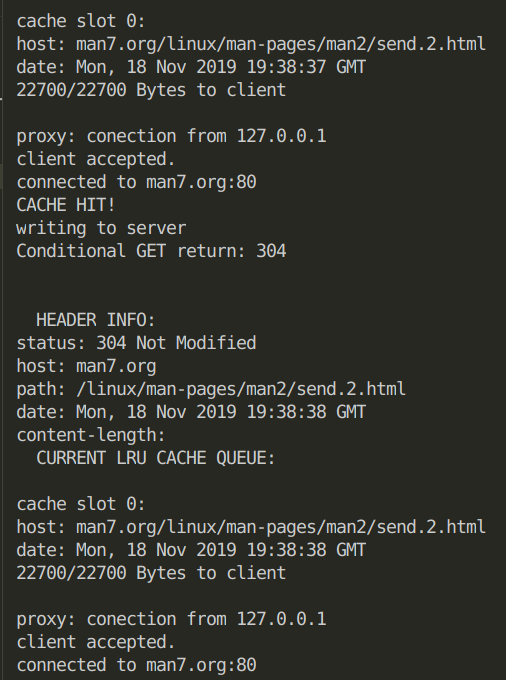
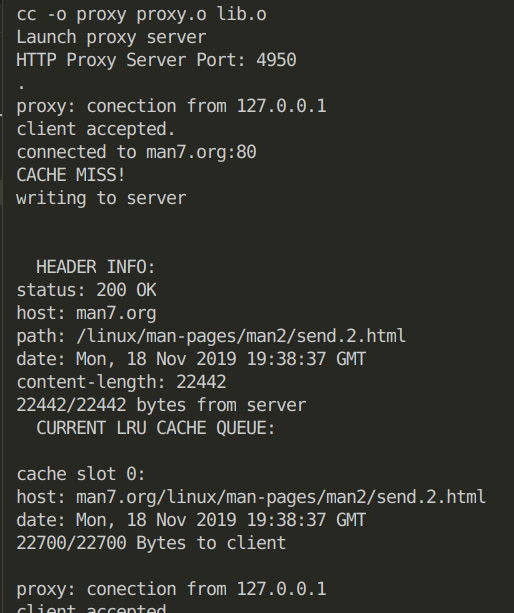
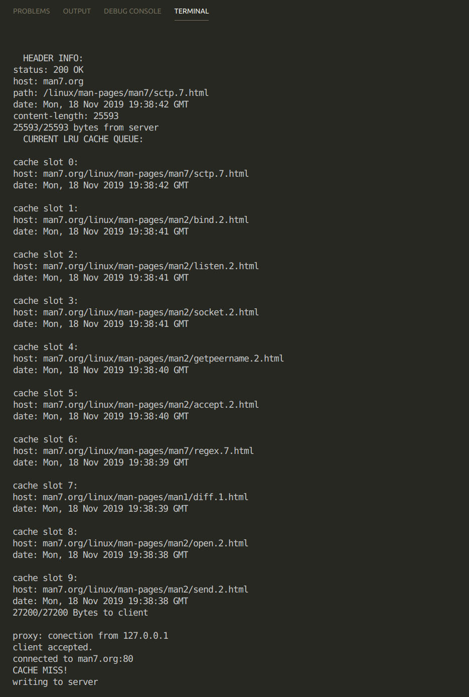
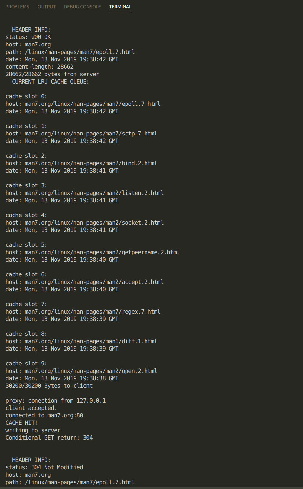

# HTTP Proxy

## Team 4

## Contribution

- Akhilesh: **Client, request and response parsers**
- Luming: **Server, Cache**

## File Structure 

- `client.c`: Contains the HTTP client code
- `proxy.c`: Contains the HTTP proxy server code
- `config.h`: Contains configuration params
- `lib.h`: utility functions used across cache, proxy server and client.

## to run

- with `run_proxy.sh` and `run_client.sh`
  - the destination address can be changed in the `run_client.sh` script.

- with `./proxy <ip to bind> <port to bind>` to run the proxy
- with `./client <proxy address> <proxy port> <URL to rerieve>` to run the client.

## Bonus Points Implemented

- Yes
* If the client request url results in a cache miss, a normal GET is sent.
* If the client request url results in a cache hit, a CONDITIONAL GET is sent with `If-Modified-Since` header field, filled with the last received `Date` value.  
    * If server response is of status code `304 Not Modified`, then the `Date` field recorded in the cache is updated to the latest received time, and the document is sent to client directly from the cache.
    * If server response is of any other status code, then the proxy server reacts accordingly, as is specified in `RFC1945 page 42-43`
* As is stated in the Bonus section, `"You can also cache a document in the proxy that is missing both Expires and Last-Modified headers"`, thus the proxy server is implemented to cache each response and check with conditional get if a cache hit ever occurs.
## Architecture

### Client

The client accepts the proxy address and port, and the destination target url as 
command line args. The client can parse the destination target url passed to it in any of the
following forms and create the correct request:

- `www.cpluscplus.com`
- `www.cpluscplus.com/some`
- `https://www.cpluscplus.com`
- `https://www.cpluscplus.com/some`

For now, we pass the host, path and user-agent in our request. Adding more fields
is trivial.

### Cache

* Our cache structure is detailed in `lib.h`. It is a doubly linked list, whose every node serves as a cache unit. Apart from relevant pointers, each node stores cache status for that node, stored response size and http header information. We also have cache print utility functions.

* During initialization of cache queue, 10 dummy nodes are filled in, thus queue remains a constant size when performing eviction and enqueue.  

### Proxy server
The proxy server maintains a record of clients connected to it simultaneously. The
assigned file descriptors are stored in another doubly linked list. We
use `select()` call to serve current connections and accept new ones. During a 
connection request from a client, the proxy server first parses the request for URL
to get the hostname and the path. To retrieve more fields, the parser can be modified which
is trivial. We then check for a similar entry in our cache. If found and
valid, the proxy server responds back to the client with the same. Otherwise, it sends the
request received to the destination url and waits for the response and caches it for it
to serve later on a similar request. 

## Test cases

- **TEST CASE 1**: A cache hit returns the saved data to the requester

- **TEST CASE 2**: A request that is not in the cache is proxied, saved in the cache and returned to the requester

- **TEST CASE 3**: A cache miss with 10 items already in the cache is proxied, saved in the LRU location in cache, and the data is returned to the requester

#### cache state before cache miss
* sctp.7.html as first node
* send.2.html as last node

#### cache state after cache miss and enqueue
* sctp.7.html as second node,
* cache miss item epoll.7 as first node
* send.2.html evicted from the queue

- **TEST CASE 4**: (Modified according to bonus feature) This test case is not necessary in a conditional get architecture. 
~~A stale `Expires` header in the cache is accessed, the cache entry is replaced with a fresh copy, and the fresh data is delivered to the requester~~

- **TEST CASE 5**: (Modified according to bonus feature) A cache hit entry verified by CONDITIONAL GET with 200 response is replaced with new content, then sent to the client

~~A stale entry in the cache without an `Expires` header is determined based on the last Web server access time and last modification time, the stale cache entry is replaced with fresh data, and the fresh data is delivered to the requester~~

- **TEST CASE 6**: (Modified according to bonus feature) A cache hit entry verified by CONDITIONAL GET with 304 response is sent to the client.

~~A cache entry without an `Expires` header that has been previously accessed from the Web server in the last 24 hours and was last modified more than one month ago is returned to the requester~~
* return cache item with 304 as response status code

- **TEST CASE 7**: Three clients can simultaneously access the proxy server and get the correct data 

