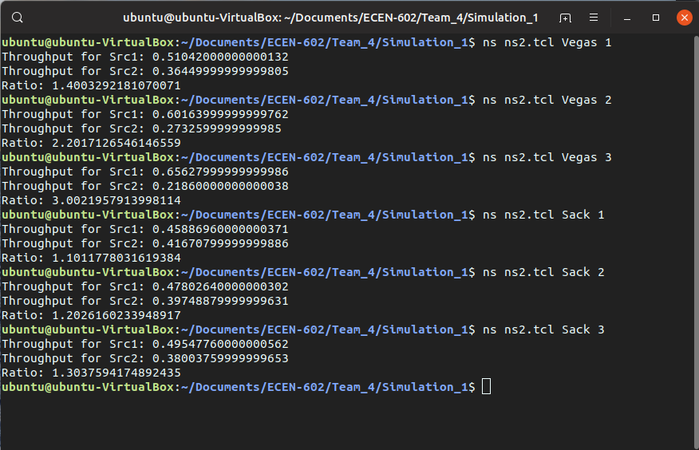

# Simulation Assignment 1

## TEAM 4
- Akhilesh: `ns2.tcl`
- Luming: `ns2.tcl`

## Setup

- Ubuntu 19.04
- ns-2.35

_Case 1:_

- src1-R1 and R2-rcv1 end-2-end delay = 5 ms   
- src2-R1 and R2-rcv2 end-2-end delay = 12.5 ms   

_Case 2:_

- src1-R1 and R2-rcv1 end-2-end delay = 5 ms   
- src2-R1 and R2-rcv2 end-2-end delay = 20 ms     

_Case 3:_
- src1-R1 and R2-rcv1 end-2-end delay = 5 ms   
- src2-R1 and R2-rcv2 end-2-end delay = 27 ms

## Procedure

- Create simularoe object
- Turn on tracing
- Create topology
- Setup packet loss, link dynamics
- Create routing agents
- Create traffic sources
- Add post-processing procedures like nam, xgraph
- Start simulation

## Results


### `TCP Vegas`

- Average throughput in Mbits/sec

.| **SRC1** | **SRC2** | Ratio
---- | ---- | ---- | ----
*Case 1* | 0.5104 | 0.3645 | 1.4003 
*Case 2* | 0.6016 | 0.2733 | 2.2017
*Case 3* | 0.6563 | 0.2186 | 3.0022

### `TCP Sack`

- Average throughput in Mbits/sec

.| **SRC1** | **SRC2** | Ratio
---- | ---- | ---- | ----
*Case 1* | 0.4589 | 0.4167 | 1.1012
*Case 2* | 0.4780 | 0.3975 | 1.2026
*Case 3* | 0.4955 | 0.3800 | 1.3037

- TCP Vegas gives better throughput that TCP Sack for the same RTT but as the RTT 
increases, the throughput for TCP Vegas decreases significantly whereas TCP Sack almost 
maintains the same throughput.
- This is apparent from the tables above.
- For case 1, where the RTT for the two sources were in the ratio of 1:2, TCP Vegas performs better than TCP Sack by a small amount. But as the RTT increased for SRC2, the throuput for Vegas decreased but Sack maintained the throughput. 

- TCP Vegas detects congestion at an incipient stage based on increasing RTT of the packets in the connection. It does not use the loss of segment to signal that there is congestion. It determines congestion by a decrease in sending rate as compared to the expected rate.
- It is also more stable than Sack. Sack uses packet losses to denote congestion. The sender continually increases the sending rate until there is a congestion and then the sender cuts back. The cycle continues and the system keeps on oscillating. 
- TCP Sack is difficult to implement since the receiver needs to send selective acknowledgements which are not currently implemented.

## Source Code
### ns2.tcl
```tcl
# Usage: ns2.tcl <TCP_flavor> <case_no> 
if {$argc != 2} {
	puts stderr "ERROR! ns2 called with wrong number of arguements! ($argc)"
	exit 1
} else {
	set flavor [lindex $argv 0]
	set case_no [lindex $argv 1]
}

# Create a simulator object
set ns [new Simulator]

# define delay 
if {$case_no == 1} {
	set src1_r1_delay 5ms
	set r2_rcv1_delay 5ms
	set src2_r1_delay 12.5ms
	set r2_rcv2_delay 12.5ms
} elseif {$case_no == 2} {
	set src1_r1_delay 5ms
	set r2_rcv1_delay 5ms
	set src2_r1_delay 20ms
	set r2_rcv2_delay 20ms
} elseif {$case_no == 3} {
	set src1_r1_delay 5ms
	set r2_rcv1_delay 5ms
	set src2_r1_delay 27.5ms 
	set r2_rcv2_delay 27.5ms
} else {
	puts stderr "ERROR! Wrong case_no ($case_no)"
}


$ns color 1 Red 
$ns color 2 Blue

# Open the nam trace file
set f1 [open out1.tr w]
set f2 [open out2.tr w]
set nf [open out.nam w]
$ns trace-all $nf
$ns namtrace-all $nf


# define variables
set src1 [$ns node]
set src2 [$ns node]
set r1 [$ns node]
set r2 [$ns node]
set rcv1 [$ns node]
set rcv2 [$ns node]

set throughput1 0
set throughput2 0
set counter 0

# define links
$ns duplex-link $src1 $r1 10Mb $src1_r1_delay DropTail
$ns duplex-link $src2 $r1 10Mb $src2_r1_delay DropTail
$ns duplex-link $r1 $r2 1Mb 5ms DropTail
$ns duplex-link $r2 $rcv1 10Mb $r2_rcv1_delay DropTail
$ns duplex-link $r2 $rcv2 10Mb $r2_rcv2_delay DropTail

$ns duplex-link-op $src1 $r1 orient right-down
$ns duplex-link-op $src2 $r1 orient right-up
$ns duplex-link-op $r1 $r2 orient right
$ns duplex-link-op $rcv1 $r2 orient left-down
$ns duplex-link-op $rcv2 $r2 orient left-up

if {[string compare $flavor "Sack"] == 0} {
	set tcp1 [new Agent/TCP/Sack1]
	$ns attach-agent $src1 $tcp1
	$tcp1 set fid_ 1

	set tcp2 [new Agent/TCP/Sack1]
	$ns attach-agent $src2 $tcp2
	$tcp2 set fid_ 2

	set sink1 [new Agent/TCPSink/Sack1]
	$ns attach-agent $rcv1 $sink1
	
	set sink2 [new Agent/TCPSink/Sack1]
	$ns attach-agent $rcv2 $sink2


} elseif {[string compare $flavor "Vegas"] == 0} {
	set tcp1 [new Agent/TCP/Vegas]
	$ns attach-agent $src1 $tcp1
	$tcp1 set fid_ 1

	set tcp2 [new Agent/TCP/Vegas]
	$ns attach-agent $src2 $tcp2
	$tcp2 set fid_ 2

	set sink1 [new Agent/TCPSink]
	$ns attach-agent $rcv1 $sink1

	set sink2 [new Agent/TCPSink]
	$ns attach-agent $rcv2 $sink2


} else {
	puts "ERROR! TCP version not supported. ($flavor)"
	exit 1
}

$ns connect $tcp1 $sink1
$ns connect $tcp2 $sink2

# setup ftp over tcp
set ftp1 [new Application/FTP]
$ftp1 attach-agent $tcp1

set ftp2 [new Application/FTP]
$ftp2 attach-agent $tcp2

# writes the data to the output files
proc record {} {
	global sink1 sink2 f1 f2 throughput1 throughput2 counter
	set ns [Simulator instance]
	set time 0.5

	set b1 [$sink1 set bytes_]
	set b2 [$sink2 set bytes_]
	set now [$ns now]

	# calculate bw in Mbits and write to the file
	set bw1 [expr $b1/$time*8/1000000]
	set bw2 [expr $b2/$time*8/1000000]

	puts $f1 "$now $bw1"
	puts $f2 "$now $bw2"

	set throughput1 [expr $throughput1 + $bw1]
	set throughput2 [expr $throughput2 + $bw2]

	set counter [expr $counter + 1]
	# reset the bytes_ values on the traffic sinks
	$sink1 set bytes_ 0
	$sink2 set bytes_ 0

	$ns at [expr $now+$time] "record"
}

# Define a 'finish' procedure
proc finish {} {
	global ns f1 f2 nf throughput1 throughput2 counter
	$ns flush-trace
	#Close the trace file
	close $f1
	close $f2
	close $nf
	# Execute nam on the trace file
	# exec nam out.nam &
	# exec xgraph out1.tr out2.tr -geometry 800x400 &
	puts "Throughput for Src1: [expr $throughput1/$counter]" 
	puts "Throughput for Src2: [expr $throughput2/$counter]" 
	puts "Ratio: [expr ($throughput1/$counter)/($throughput2/$counter)]"

	exit 0
}

#Call the finish procedure after 5 seconds simulation time
$ns at 50.0 "$ftp1 start"
$ns at 50.0 "$ftp2 start"
$ns at 100.0 "record"
$ns at 400.0 "$ftp2 stop"
$ns at 400.0 "$ftp1 stop"
$ns at 500.0 "finish"

#Run the simulation
$ns run

```

## References:
- https://en.wikipedia.org/wiki/TCP_Vegas
- https://inst.eecs.berkeley.edu/~ee122/fa05/projects/Project2/SACKRENEVEGAS.pdf


